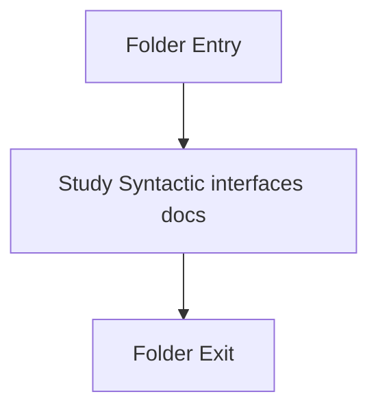

# Input-and-CLI

- Folder: `docs/Codebase/Microservice/Modules/Header/Analysis/Input`
- Descendant source docs: 2
- Generated on: 2026-04-23

## Logic Summary
Contracts that describe how source files enter the syntactic subsystem and how command input is represented.

## Subsystem Story
This folder is mostly leaf-level. The local documents here carry the main explanation of the subsystem without requiring much extra descent.

## Folder Flow

## Documents By Logic
### Syntactic Interfaces
These documents explain the local implementation by covering Declares the public interfaces and shared data types for the generic parse and analysis pipeline.
- cli_arguments.hpp.md : Declares the public interfaces and shared data types for the generic parse and analysis pipeline.
- source_reader.hpp.md : Declares the public interfaces and shared data types for the generic parse and analysis pipeline.

## Reading Hint
- This folder is mostly leaf-level. Read the local file docs to understand the logic in this area.

