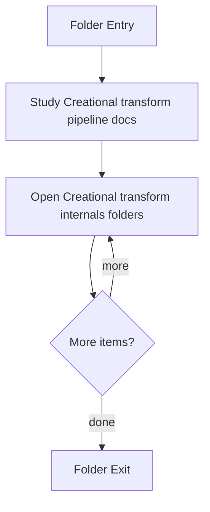

# Transform

- Folder: docs/Codebase/Microservice/Modules/Source/Analysis/Patterns/Families/Creational/Transform
- Descendant source docs: 18
- Generated on: 2026-04-23

## Logic Summary
Older creational transform and evidence helpers kept separate from the current tagging runtime path.

## Subsystem Story
This folder mixes concrete local documents with deeper child subsystems. Read the local docs to understand the visible behavior first, then descend into the child folders for the lower-level detail that supports it.

## Folder Flow

## Child Folders By Logic
### Creational Transform Internals
These child folders continue the subsystem by covering Internal helpers used by the older creational transform path.
- internal/ : Internal helpers used by the older creational transform path.

## Documents By Logic
### Creational Transform Pipeline
These documents explain the local implementation by covering Implements creational transform dispatch, evidence rendering, and rewrite helpers.
- creational_code_generator_internal.cpp.md : Implements creational transform dispatch, evidence rendering, and rewrite helpers.
- creational_transform_evidence.cpp.md : Implements creational transform dispatch, evidence rendering, and rewrite helpers.
- creational_transform_evidence_main_retention.cpp.md : Implements creational transform dispatch, evidence rendering, and rewrite helpers.
- creational_transform_evidence_model.cpp.md : Implements creational transform dispatch, evidence rendering, and rewrite helpers.
- creational_transform_evidence_render.cpp.md : Implements creational transform dispatch, evidence rendering, and rewrite helpers.
- creational_transform_evidence_scan.cpp.md : Implements creational transform dispatch, evidence rendering, and rewrite helpers.
- creational_transform_evidence_signatures.cpp.md : Implements creational transform dispatch, evidence rendering, and rewrite helpers.
- creational_transform_evidence_skeleton.cpp.md : Implements creational transform dispatch, evidence rendering, and rewrite helpers.
- creational_transform_factory_reverse.cpp.md : Implements creational transform dispatch, evidence rendering, and rewrite helpers.
- creational_transform_factory_reverse_cleanup.cpp.md : Implements creational transform dispatch, evidence rendering, and rewrite helpers.
- creational_transform_factory_reverse_parse.cpp.md : Implements creational transform dispatch, evidence rendering, and rewrite helpers.
- creational_transform_factory_reverse_parse_literals.cpp.md : Implements creational transform dispatch, evidence rendering, and rewrite helpers.
- creational_transform_factory_reverse_parse_mapping.cpp.md : Implements creational transform dispatch, evidence rendering, and rewrite helpers.
- creational_transform_factory_reverse_rewrite.cpp.md : Implements creational transform dispatch, evidence rendering, and rewrite helpers.
- creational_transform_pipeline.cpp.md : Implements creational transform dispatch, evidence rendering, and rewrite helpers.
- creational_transform_rules.cpp.md : Implements creational transform dispatch, evidence rendering, and rewrite helpers.

## Reading Hint
- Read the local file docs first for concrete behavior, then descend into the child folders for narrower subsystem details.

