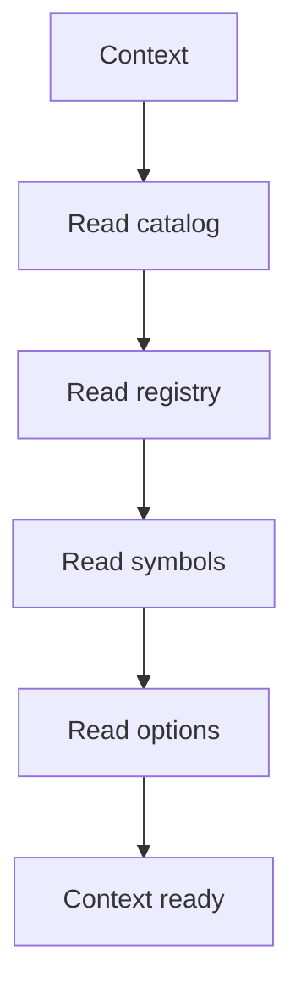

# Context

## Purpose
Context carries shared data from the middleman to hooks.

## Files As Implementation Units
- `pattern_context.cpp.md` represents the immutable recognition context.
- It carries catalog definitions, registry data, symbols, and options.
- Hooks read this context instead of rebuilding shared state.

## Folder Flow

