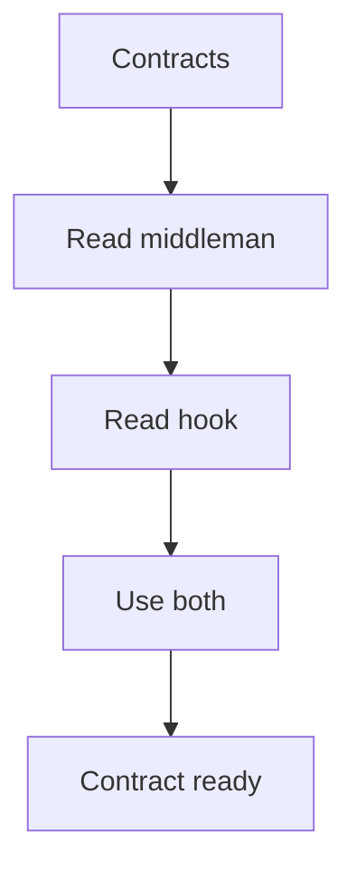

# Contracts

## Purpose
Contracts define the public shape of the single catalog-driven middleman and the pattern hooks.

## Files As Interfaces
- `pattern_middleman_contract.cpp.md` is the caller-facing recognition interface.
- `pattern_hook_contract.cpp.md` is the hook-facing algorithm interface.
- Both Behavioural and Creational code depend on these same contracts.

## Folder Flow

