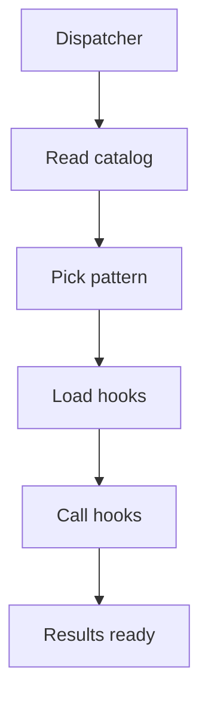

# Dispatcher

## Purpose
Dispatcher iterates catalog definitions, selects needed hooks, and calls hooks through the shared contract.

## Files As Implementation Units
- `pattern_hook_dispatcher.cpp.md` represents hook routing.
- It decides which pattern hooks run for each catalog definition.
- It keeps Behavioural and Creational selection inside one shared pipeline.

## Folder Flow

