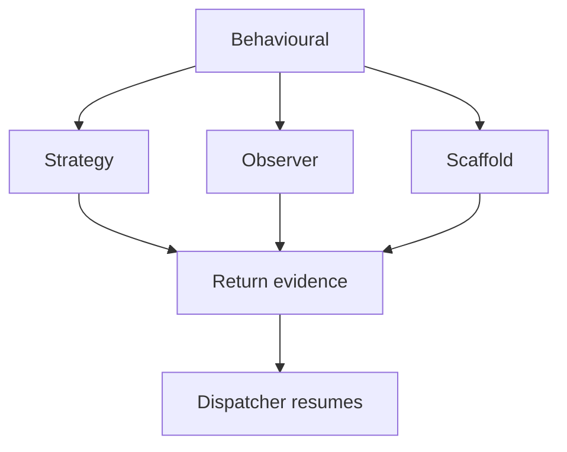

# Behavioural Hooks

## Purpose
Behavioural hooks inspect shared context and return behavioural evidence. They do not register classes/functions and do not assemble trees.

## Files As Implementation Units
- `strategy_hook.cpp.md` owns Strategy checks.
- `observer_hook.cpp.md` owns Observer checks.
- `scaffold_hook.cpp.md` owns reusable Behavioural scaffold checks.
- All three use the same middleman context and hook contract.

## Folder Flow

