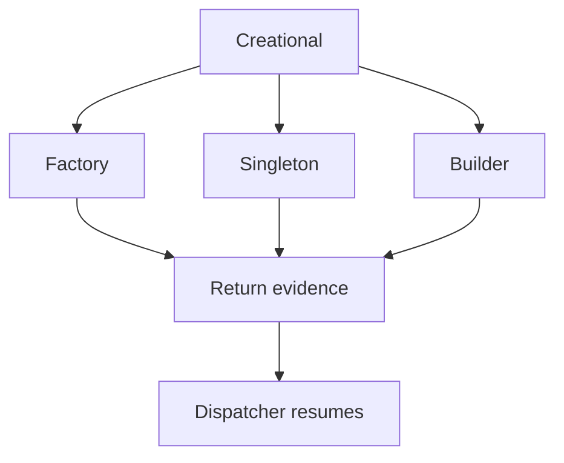

# Creational Hooks

## Purpose
Creational hooks inspect shared context and return creational evidence. They do not register classes and do not assemble trees.

## Files As Implementation Units
- `factory_hook.cpp.md` owns Factory checks.
- `singleton_hook.cpp.md` owns Singleton checks.
- `builder_hook.cpp.md` owns Builder checks.
- All three use the same middleman context and hook contract.

## Folder Flow

