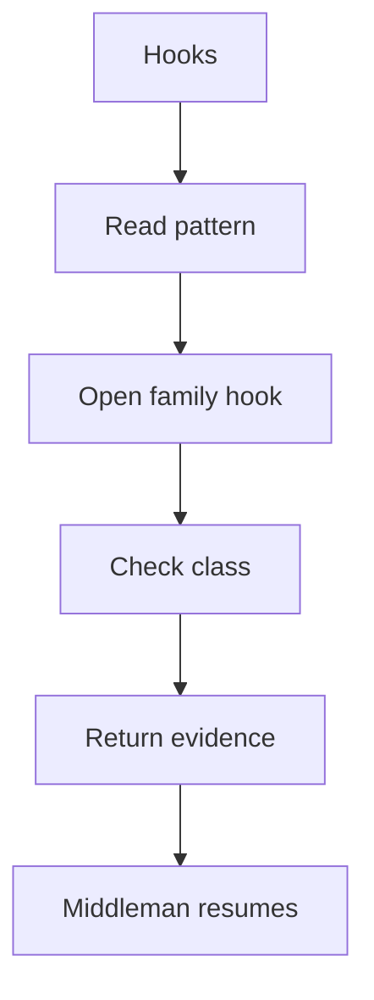

# Hooks

## Purpose
Hooks contain pattern-specific algorithms used when catalog rules need custom evidence. They are the only parts that differ by pattern family.

## Files As Implementation Units
- `Creational/*_hook.cpp.md` files represent Creational algorithms.
- `Behavioural/*_hook.cpp.md` files represent Behavioural algorithms.
- Hook files do not own class registration, context creation, dispatch, or tree assembly.
- Hook files receive catalog definitions instead of relying on user-selected source-pattern input.

## Folder Flow

