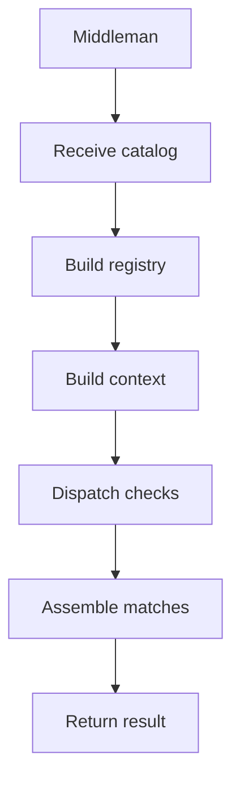

# Middleman

## Purpose
Middleman owns the end-to-end catalog recognition process and delegates only pattern-specific evidence checks to hooks.

## Files As Implementation Units
- `pattern_middleman.cpp.md` represents the one shared orchestration module.
- Behavioural and Creational catalog definitions pass through this same file.
- Shared logic overlaps here instead of being copied into separate family paths.

## Folder Flow

