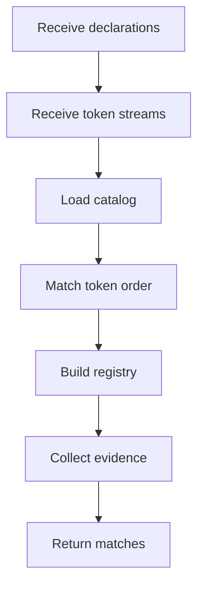

# Patterns

- Folder: `docs/Codebase/Microservice/Modules/Source/Analysis/Patterns`
- Role: shared pattern analysis boundary after lexical structure, generated class declarations, and usage context already exist.

## Read Order
1. `Catalog/`
2. `Middleman/`
3. `Families/`
4. `Families/Behavioural/`
5. `Families/Creational/`

## Boundary
- `Catalog/` owns the data format and parser for supported pattern structures.
- `Middleman/` stays outside the family folder because it owns shared orchestration, contracts, dispatch, registry behavior, and migration planning.
- `Families/` groups pattern families that use the shared middleman boundary.
- `Families/Behavioural/` owns behavioural-specific detection, structure, scaffold, and symbol-test logic.
- `Families/Creational/` owns creational-specific detection, structure, scaffold, symbol-test, and transform logic.

## Placement Rule
- Add new supported pattern structures through `Catalog/` first.
- Put pattern families under `Families/` when they are specific categories of pattern logic.
- Keep cross-family orchestration outside `Families/`; it belongs in `Middleman/`.
- Do not place `Middleman/` inside `Families/` because it is the dispatcher and contract layer used by multiple families.

## Recognition Order

## Acceptance Checks
- Pattern recognition does not depend on a user-selected source pattern.
- Every enabled catalog pattern is eligible for every completed class declaration.
- Catalog entries carry ordered token sequences for parser cross-reference.
- Adding a new structure starts with catalog data before custom hook code.
