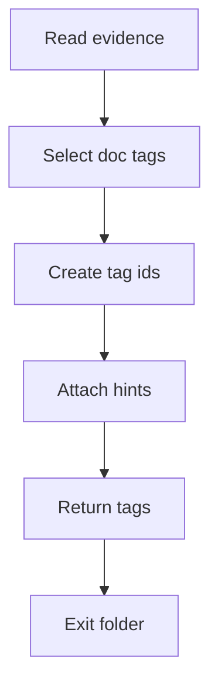

# DocumentationTagger

- Folder: `docs/Codebase/Microservice/Modules/Source/OutputGeneration/DocumentationTagger`
- Role: generate documentation-facing design-pattern tags

## Start Here
- Read `build_design_pattern_tags.cpp.md` first for the target-selection rules, then read `add_design_pattern_tag.cpp.md` for insertion details.

## What Belongs Here
- tag building
- tag ID generation
- tag size estimation
- documentation-target selection from detected pattern evidence
- code-unit hints for backend AI documentation

## What Stays Outside
- report assembly stays in `../Report/`
- unit-test generation stays in `../UnitTestGeneration/`
- AI provider calls stay in the backend service layer

## Folder Flow

## Acceptance Checks

- Tags use documentation language, not refactor language.
- Tags can be converted into both documentation targets and unit-test targets.
- Tags include enough code context for backend AI prompt assembly.

