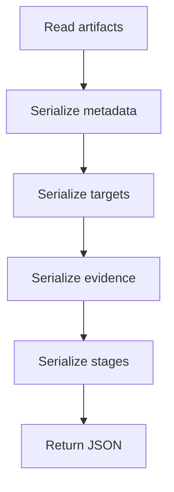

# Report

- Folder: `docs/Codebase/Microservice/Modules/Source/OutputGeneration/Report`
- Role: structured report assembly for detected design-pattern evidence, documentation targets, and unit-test targets

## Read Order

1. `pipeline_report_to_json.cpp.md`
2. helper fragments such as JSON escaping and array serializers

## Ownership Boundary

This folder owns JSON report structure only. It does not detect patterns, choose documentation targets, generate AI text, or write frontend UI state.

## What Belongs Here

- report metadata fields.
- documentation target arrays.
- unit-test target arrays.
- design-pattern evidence serialization.
- graph and stage diagnostics.

## What Stays Outside

- `../DocumentationTagger/` chooses design-pattern tags.
- `../UnitTestGeneration/` chooses unit-test target semantics.
- backend services assemble AI prompts from report data.
- frontend scripts render report data.

## Folder Flow

## Acceptance Checks

- Report docs use documentation and unit-test language.
- Refactor terminology is absent from live documentation reports.
- Source/target pattern fields are not treated as frontend inputs.
