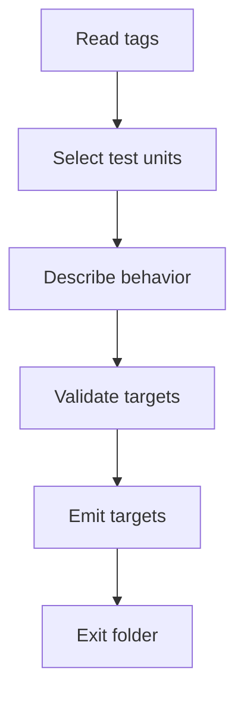

# UnitTestGeneration

- Folder: `docs/Codebase/Microservice/Modules/Source/OutputGeneration/UnitTestGeneration`
- Role: unit-test target generation from detected design-pattern evidence

## Start Here
- `core.cpp.md` is the entrypoint for the output-side orchestration that prepares unit-test-oriented artifacts.

## What Belongs Here
- validation gates
- size or artifact estimation that informs test generation
- normalization or rewrite steps that prepare a stable test target
- mapping documentation tags into unit-test targets
- expected behavior notes for pattern-specific branches, contracts, and usages

## What Stays Outside
- documentation tags stay in `../DocumentationTagger/`
- JSON assembly stays in `../Report/`
- HTML or text rendering stays in `../Render/`

## Folder Flow

## Acceptance Checks

- Unit-test targets are derived from detected pattern evidence.
- Unit-test target records share stable target IDs with related documentation targets when they describe the same code unit.
- This folder does not use refactor terminology.

