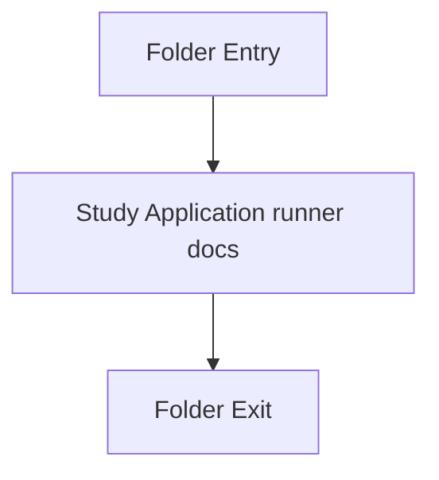

# Back system

- Folder: `docs/Codebase/Microservice/Runtime/Back system`
- Descendant source docs: 1
- Generated on: 2026-04-23

## Logic Summary
The runtime runner that ties CLI parsing, file discovery, pipeline execution, and output writing together.

## Subsystem Story
This folder documents the concrete application runner under the clearer `Runtime/` boundary. The local documents carry the runtime story without mixing it into reusable module internals.

## Folder Flow

## Documents By Logic
### Application Runner
These documents explain the local implementation by covering Owns application-layer orchestration around parsing, documentation tagging, and report emission.
- syntacticBrokenAST.cpp.md : Owns application-layer orchestration around parsing, documentation tagging, and report emission.

## Reading Hint
- Start from `../README.md` for the runtime boundary, then read `syntacticBrokenAST.cpp.md` for the runner details.

