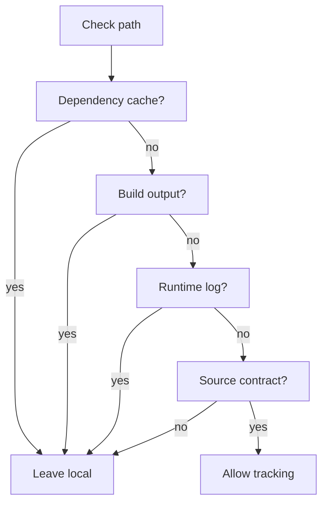

# .gitignore

- Source: .gitignore
- Kind: repository hygiene configuration
- Updated on: 2026-04-25

## Story
### What Happens Here

This file keeps dependency caches, compiler output, generated frontend bundles, runtime logs, local editor state, and OS artifacts out of Git. It protects the source tree and `docs/Codebase` blueprint from files that can be regenerated from manifests, build configuration, or runtime execution.

### Why It Matters In The Flow

The backend and frontend Node dependencies should be restored from package manifests instead of committed. The C++ microservice build directories should be regenerated by CMake or Ninja instead of pushed. The repository should only track source, docs, configuration contracts, lockfiles, and deliberate fixtures.

### What To Watch While Reading

Ignore rules should block broad artifact families without hiding implementation files. Keep source files, Markdown blueprints, package manifests, lockfiles, CMake configuration, and sample inputs visible to Git.

## Ignore Flow
The repository should decide whether a path is source or a local artifact before it reaches staging.

## Cleanup Handoff

The current cleanup goal is to remove committed dependency and build artifacts from the branch head before pushing again.

Recommended local cleanup:
- Run `git rm -r --cached node_modules` when root `node_modules/` is tracked.
- If any build folder is tracked, run `git rm -r --cached build build-msys build-ninja dist` for the tracked folders only.
- Commit the `.gitignore`, docs, and staged artifact removals together.
- Use `git push --force-with-lease origin main` only when intentionally replacing the remote branch tip.

History rewrite is a separate destructive step. Use it only when the goal is to remove artifact blobs from older commits, not just from the latest branch tree. That flow requires a clean worktree, a path-removal tool such as `git filter-repo` or BFG, and a coordinated `--force-with-lease` push.

## Acceptance Checks

- `git check-ignore -v node_modules build-ninja dist` reports matching ignore rules.
- `git ls-files` has no matches under `node_modules/`, `build/`, `build-msys/`, `build-ninja/`, or `dist/` after cleanup.
- `git status --short` shows only intentional source/docs changes and staged artifact removals.
- Future package installs and CMake/Ninja builds do not create new untracked artifact noise.
