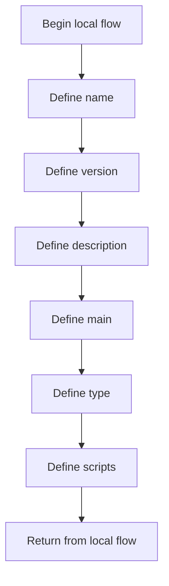

# package.json

- Source: Backend/package.json
- Kind: JSON configuration

## Story
### What Happens Here

This manifest tells the backend runtime how to start and what to load. Its implementation role is declarative: it defines the executable scripts and package dependencies that make the Express service run.

### Why It Matters In The Flow

This artifact participates in the repository flow according to the surrounding module or toolchain that loads it.

### What To Watch While Reading

Declares backend scripts and runtime dependencies. The main surface area is easiest to track through symbols such as name, version, description, and main.

## Program Flow
This diagram follows the action path in plain words. Decision diamonds show where the file can stop, branch, or repeat work instead of simply passing through a straight line.

## Reading Map
Read this file as: Declares backend scripts and runtime dependencies.

Where it sits in the run: This artifact participates in the repository flow according to the surrounding module or toolchain that loads it.

Names worth recognizing while reading: name, version, description, main, type, and scripts.

## Documentation Note
- This markdown file is part of the generated docs/Codebase mirror.
- It was generated from the repository state on 2026-04-23 after reading the existing docs corpus and the current source tree.

