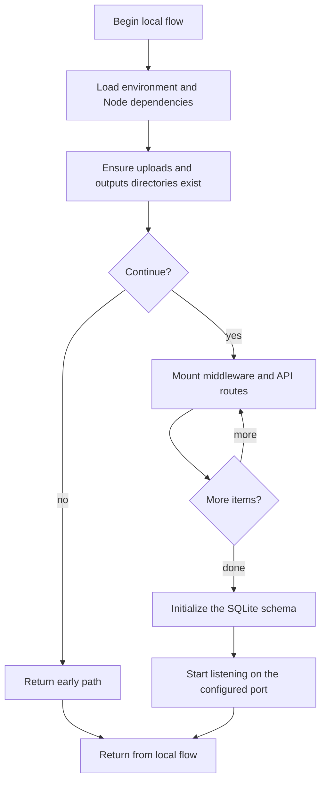

# server.js

- Source: Backend/server.js
- Kind: JavaScript module

## Story
### What Happens Here

This file is the backend runtime bootstrapper. Its implementation loads environment configuration, creates the working directories used for uploads and outputs, mounts the security and routing middleware stack, initializes the SQLite schema, and finally opens the HTTP listener.

### Why It Matters In The Flow

Backend process entrypoint: it starts before any API request can reach auth or transform handlers.

### What To Watch While Reading

Bootstraps the Express backend, middleware stack, routes, database initialization, and filesystem layout. The main surface area is easiest to track through symbols such as express, helmet, cors, and morgan. It collaborates directly with dotenv, express, helmet, and cors.

## Program Flow
This diagram follows the action path in plain words. Decision diamonds show where the file can stop, branch, or repeat work instead of simply passing through a straight line.

## Reading Map
Read this file as: Bootstraps the Express backend, middleware stack, routes, database initialization, and filesystem layout.

Where it sits in the run: Backend process entrypoint: it starts before any API request can reach auth or transform handlers.

Names worth recognizing while reading: express, helmet, cors, morgan, path, and fs.

It leans on nearby contracts or tools such as dotenv, express, helmet, cors, morgan, and path.

## Documentation Note
- This markdown file is part of the generated docs/Codebase mirror.
- It was generated from the repository state on 2026-04-23 after reading the existing docs corpus and the current source tree.

