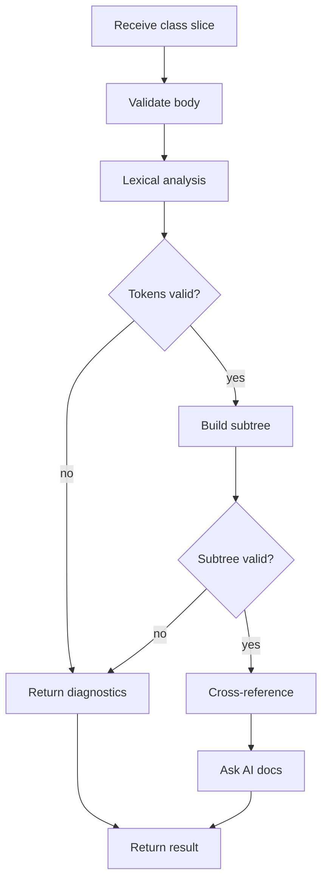

# transformController.js

- Source: `Backend/src/controllers/transformController.js`
- Kind: JavaScript module

## Story
### What Happens Here

This controller owns HTTP request handling for analysis-related work. For the live editor path, it receives a completed class declaration slice, validates the request version and class range, delegates lexical and subtree analysis to services, asks the AI documentation service to document the selected code units, writes a structured log event, and returns normalized analysis data to the frontend.

The controller should stop using transform/refactor wording for this path. The user is not requesting code rewriting. The product behavior is now documentation and unit-test generation for code parts that exist because a design pattern was detected.

### Why It Matters In The Flow

This is the backend handoff between frontend trigger logic and deeper analysis services. It must protect the backend from incomplete editor input and keep the response shape stable for the live UI.

### What To Watch While Reading

Do not accept source-pattern, target-pattern, source-input, source-output, or refactor-candidate fields from the frontend. The algorithm detects pattern evidence through cross-referencing after lexical analysis and subtree construction.

## Live Class Flow



## Request Contract

Expected request body:

```json
{
  "documentId": "active-editor",
  "documentVersion": 17,
  "className": "Factory",
  "classRange": {
    "startOffset": 128,
    "endOffset": 615
  },
  "code": "class Factory { ... };"
}
```

Rejected request fields:
- `sourcePattern`
- `targetPattern`
- `sourceInput`
- `sourceOutput`
- `refactorCandidate`

## Response Contract

Expected successful response:

```json
{
  "documentVersion": 17,
  "accepted": true,
  "stage": "complete",
  "detectedPattern": "factory",
  "diagnostics": [],
  "documentationTargets": [],
  "unitTestTargets": [],
  "aiDocumentation": {
    "status": "generated",
    "sections": []
  }
}
```

Diagnostics responses should keep the same shape and set `accepted` to `false` only when the request itself cannot be analyzed.

## AI Documentation Boundary

The controller must pass the AI service the exact code units that need documentation. These code units come from the analysis result, not from a manual frontend selection.

Each AI input item should include:
- detected pattern.
- tag type.
- symbol name.
- file path if available.
- class range or evidence hash.
- code excerpt to document.
- documentation hint.
- related unit-test target when available.

## Structured Log Event

The controller should write one structured event per accepted class analysis. The event should include the normalized analysis result and AI documentation status, not raw upload paths or transform output paths.

## Acceptance Checks

- The live endpoint waits for complete class input before deeper services run.
- Lexical errors stop subtree, cross-reference, and AI documentation work.
- Subtree errors stop cross-reference and AI documentation work.
- Successful analysis includes the code excerpts to document in the backend AI payload.
- Refactor terminology is absent from the live analysis response.
