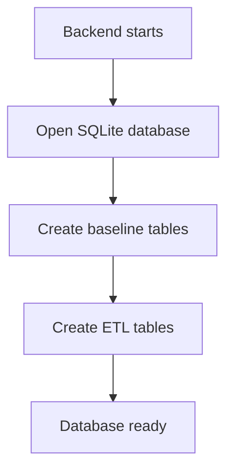

# db

- Folder: docs/Codebase/Backend/src/db
- Future source folder: Codebase/Backend/src/db

## Logic Summary
This folder owns SQLite connection setup and startup-time schema creation. The ETL schema belongs here because it is persistence structure, not route logic or transform execution logic.

## Read Order
1. `database.js.md` explains how the backend opens the SQLite database.
2. `initDb.js.md` explains the schema boot sequence and where schema modules are called.
3. `etlSchema.js.md` defines the ETL persistence blueprint that Claude should implement as a schema module.

## Folder Flow
The DB layer should stay small: open the database, initialize baseline tables, then initialize feature schemas such as ETL.

## Documents By Logic
- `database.js.md`: SQLite connection boundary.
- `initDb.js.md`: startup schema entrypoint.
- `etlSchema.js.md`: ETL runs, steps, artifacts, errors, and metrics schema blueprint.

## Ownership Boundary
This folder should only describe database structure and DB initialization. ETL execution, file transformation, parsing, and output generation should remain outside this folder and only write their state into these tables.

