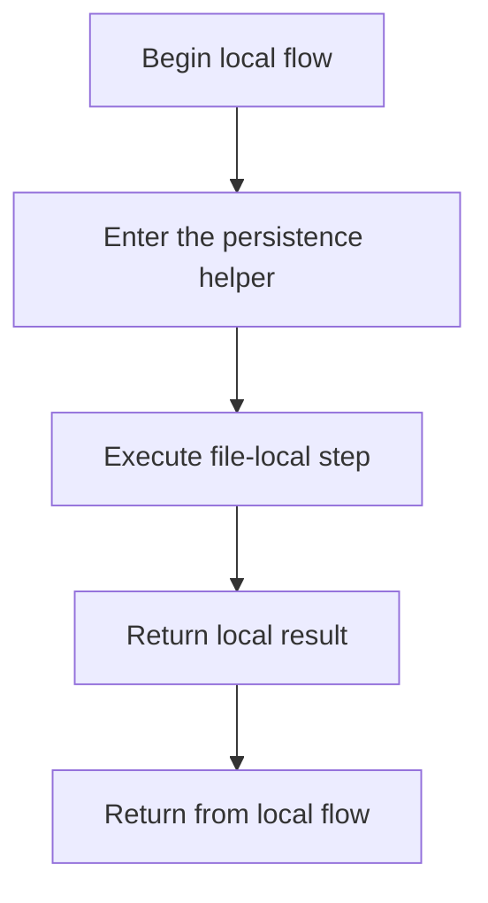

# database.js

- Source: Backend/src/db/database.js
- Kind: JavaScript module

## Story
### What Happens Here

This file lives in the persistence layer of the backend. Its implementation supports startup-time or request-time SQLite operations used by the HTTP layer.

### Why It Matters In The Flow

Supports backend startup and request-time persistence operations.

### What To Watch While Reading

Owns SQLite connectivity and schema initialization. The main surface area is easiest to track through symbols such as Database, path, dbPath, and db. It collaborates directly with better-sqlite3 and path.

## Program Flow
This diagram follows the action path in plain words. Decision diamonds show where the file can stop, branch, or repeat work instead of simply passing through a straight line.

## Reading Map
Read this file as: Owns SQLite connectivity and schema initialization.

Where it sits in the run: Supports backend startup and request-time persistence operations.

Names worth recognizing while reading: Database, path, dbPath, and db.

It leans on nearby contracts or tools such as better-sqlite3 and path.

## Documentation Note
- This markdown file is part of the generated docs/Codebase mirror.
- It was generated from the repository state on 2026-04-23 after reading the existing docs corpus and the current source tree.

