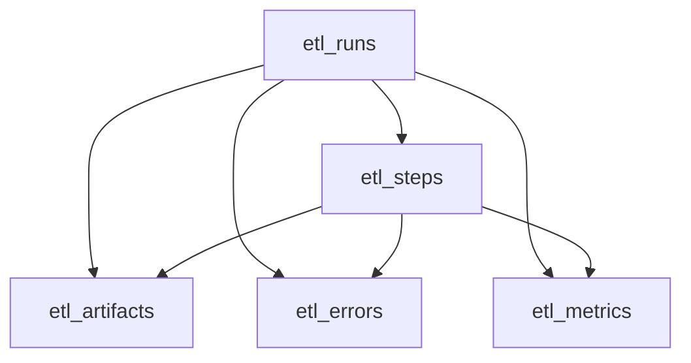
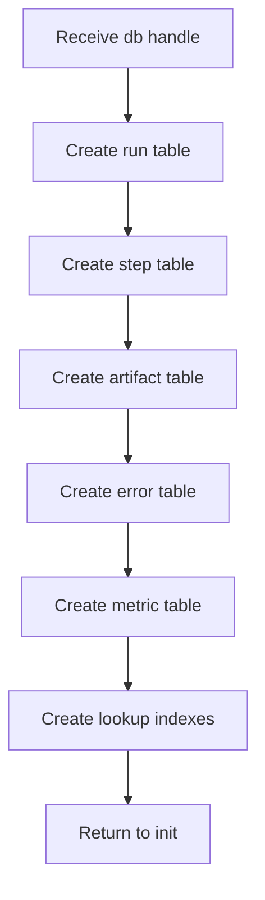

# etlSchema.js

- Future source: Backend/src/db/etlSchema.js
- Kind: JavaScript schema module

## Purpose
This file should define the ETL database schema for tracking transformation work from ingestion through output. It should not run ETL logic itself. It only creates tables, constraints, and indexes needed by the backend to record ETL state.

## Implementation Boundary
Claude should implement this as a small schema module exported from `etlSchema.js`, then call it from `initDb.js`.

Expected shape:

```js
function initEtlSchema(db) {
  // create ETL tables and indexes here
}

module.exports = { initEtlSchema };
```

## Schema Flow
This diagram shows the local schema relationship, not the runtime ETL algorithm.



## Tables

### etl_runs
Represents one ETL pipeline execution for an uploaded source file.

Columns:
- `id INTEGER PRIMARY KEY AUTOINCREMENT`
- `job_id INTEGER`
- `user_id INTEGER`
- `source_file_path TEXT NOT NULL`
- `target_file_path TEXT`
- `pipeline_status TEXT NOT NULL DEFAULT 'pending'`
- `started_at TEXT NOT NULL DEFAULT (datetime('now'))`
- `completed_at TEXT`
- `created_at TEXT NOT NULL DEFAULT (datetime('now'))`
- `updated_at TEXT NOT NULL DEFAULT (datetime('now'))`

Foreign keys:
- `job_id` references `jobs(id)`
- `user_id` references `users(id)`

### etl_steps
Represents ordered stages inside one ETL run.

Columns:
- `id INTEGER PRIMARY KEY AUTOINCREMENT`
- `etl_run_id INTEGER NOT NULL`
- `step_name TEXT NOT NULL`
- `step_order INTEGER NOT NULL`
- `step_status TEXT NOT NULL DEFAULT 'pending'`
- `input_ref TEXT`
- `output_ref TEXT`
- `started_at TEXT`
- `completed_at TEXT`
- `created_at TEXT NOT NULL DEFAULT (datetime('now'))`
- `updated_at TEXT NOT NULL DEFAULT (datetime('now'))`

Constraints:
- `etl_run_id` references `etl_runs(id)` with cascade delete
- unique pair: `etl_run_id`, `step_order`
- unique pair: `etl_run_id`, `step_name`

Expected step names:
- `extract`
- `structural_analysis`
- `tree_generation`
- `hash_propagation`
- `output_generation`
- `load`

### etl_artifacts
Represents files or serialized payloads produced by a run or step.

Columns:
- `id INTEGER PRIMARY KEY AUTOINCREMENT`
- `etl_run_id INTEGER NOT NULL`
- `etl_step_id INTEGER`
- `artifact_type TEXT NOT NULL`
- `artifact_path TEXT`
- `artifact_payload TEXT`
- `content_hash TEXT`
- `created_at TEXT NOT NULL DEFAULT (datetime('now'))`

Foreign keys:
- `etl_run_id` references `etl_runs(id)` with cascade delete
- `etl_step_id` references `etl_steps(id)` and should become null if the step row is deleted

### etl_errors
Represents recoverable or terminal ETL failures.

Columns:
- `id INTEGER PRIMARY KEY AUTOINCREMENT`
- `etl_run_id INTEGER NOT NULL`
- `etl_step_id INTEGER`
- `error_code TEXT`
- `error_message TEXT NOT NULL`
- `error_payload TEXT`
- `created_at TEXT NOT NULL DEFAULT (datetime('now'))`

Foreign keys:
- `etl_run_id` references `etl_runs(id)` with cascade delete
- `etl_step_id` references `etl_steps(id)` and should become null if the step row is deleted

### etl_metrics
Represents numeric counters and timings produced by ETL stages.

Columns:
- `id INTEGER PRIMARY KEY AUTOINCREMENT`
- `etl_run_id INTEGER NOT NULL`
- `etl_step_id INTEGER`
- `metric_name TEXT NOT NULL`
- `metric_value REAL NOT NULL`
- `metric_unit TEXT`
- `created_at TEXT NOT NULL DEFAULT (datetime('now'))`

Foreign keys:
- `etl_run_id` references `etl_runs(id)` with cascade delete
- `etl_step_id` references `etl_steps(id)` and should become null if the step row is deleted

## Indexes
Create indexes for common lookups:
- `etl_runs(job_id)`
- `etl_runs(user_id)`
- `etl_runs(pipeline_status)`
- `etl_steps(etl_run_id)`
- `etl_steps(step_status)`
- `etl_artifacts(etl_run_id)`
- `etl_artifacts(etl_step_id)`
- `etl_errors(etl_run_id)`
- `etl_metrics(etl_run_id)`

## Initialization Flow
This file should only create schema objects and then return control to `initDb.js`.



## Acceptance Checks
- `initEtlSchema(db)` is idempotent through `CREATE TABLE IF NOT EXISTS` and `CREATE INDEX IF NOT EXISTS`.
- ETL tables do not contain transformation logic; they only persist state, artifacts, errors, and metrics.
- `etl_steps` records ordered stage execution for one `etl_runs` row.
- Runtime code can attach ETL state to existing `jobs` and `users` without replacing those baseline tables.
