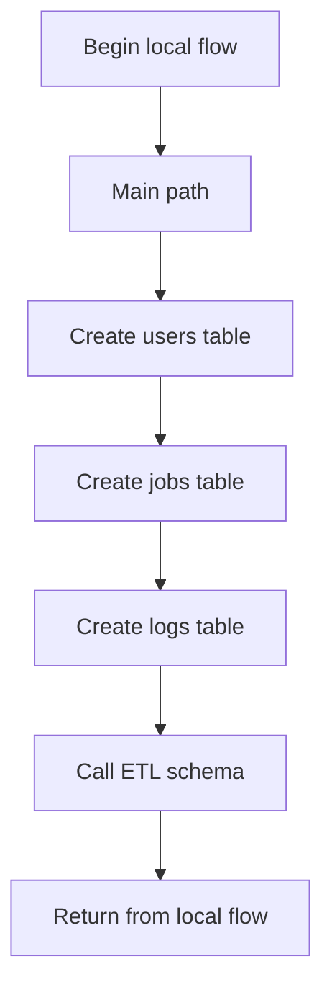
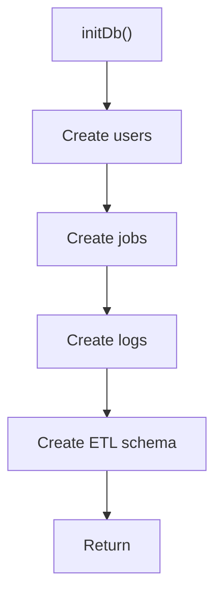

# initDb.js

- Source: Backend/src/db/initDb.js
- Kind: JavaScript module

## Story
### What Happens Here

This file implements the database bootstrapping sequence. It creates the users, jobs, and logs tables if they do not already exist so the backend can start in a valid persistence state. In the target ETL implementation, this file should also call the ETL schema module after the baseline tables are ready.

### Why It Matters In The Flow

Supports backend startup and request-time persistence operations.

### What To Watch While Reading

Owns startup schema initialization. The main surface area is easiest to track through symbols such as `initDb` and `db`. It collaborates directly with `./database`, and should call `./etlSchema` after baseline table creation.

## Program Flow
This diagram follows the action path in plain words. Decision diamonds show where the file can stop, branch, or repeat work instead of simply passing through a straight line.

## Reading Map
Read this file as: Owns SQLite connectivity and schema initialization.

Where it sits in the run: Supports backend startup and request-time persistence operations.

Names worth recognizing while reading: initDb and db.

It leans on nearby contracts or tools such as `./database`. The ETL extension should live in `./etlSchema` instead of adding all ETL table creation directly into this file.

## Story Groups

### Main Path
These steps drive the main execution path by calling the supporting work in order.
- initDb(): Create baseline tables, then delegate ETL tables to `initEtlSchema(db)`

## Function Stories

### initDb()
This routine prepares or drives one of the main execution paths in the file.

Inside the body, it should keep the startup sequence readable by creating baseline tables first, then delegating ETL schema creation to a local DB schema module.

What it does:
- create baseline tables
- call feature schema modules
- keep schema initialization idempotent

Flow:

## Documentation Note
- This markdown file is part of the generated docs/Codebase mirror.
- It was generated from the repository state on 2026-04-23 after reading the existing docs corpus and the current source tree.

