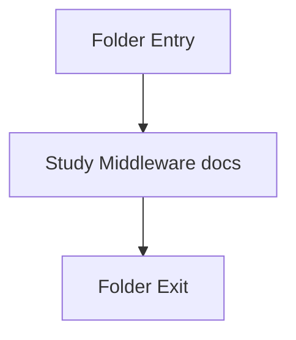

# middleware

- Folder: docs/Codebase/Backend/src/middleware
- Descendant source docs: 3
- Generated on: 2026-04-23

## Logic Summary
Cross-cutting backend request logic such as auth, upload handling, and error shaping.

## Subsystem Story
This folder is mostly leaf-level. The local documents here carry the main explanation of the subsystem without requiring much extra descent.

## Folder Flow

## Documents By Logic
### Middleware
These documents explain the local implementation by covering Applies request-shaping concerns such as auth, uploads, and error handling.
- errorHandler.js.md : Applies request-shaping concerns such as auth, uploads, and error handling.
- jwtAuth.js.md : Applies request-shaping concerns such as auth, uploads, and error handling.
- upload.js.md : Applies request-shaping concerns such as auth, uploads, and error handling.

## Reading Hint
- This folder is mostly leaf-level. Read the local file docs to understand the logic in this area.

