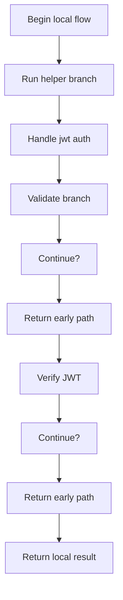
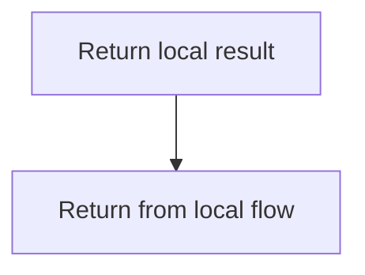
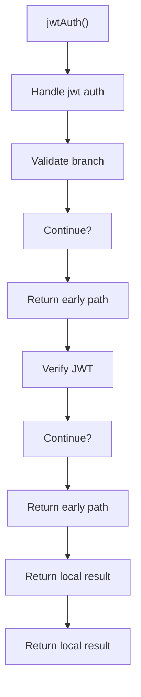
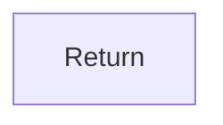

# jwtAuth.js

- Source: Backend/src/middleware/jwtAuth.js
- Kind: JavaScript module

## Story
### What Happens Here

This middleware implements the authentication gate in front of protected backend routes. It inspects the Authorization header, verifies the bearer token, attaches the decoded user identity on success, and short-circuits the request with a 401 response on failure. This middleware file shapes request flow before or after controller logic. Its implementation exists to enforce cross-cutting policy around validation, security, request data handling, or error formatting.

### Why It Matters In The Flow

Executes around route handling to validate, enrich, or reject requests.

### What To Watch While Reading

Applies request-shaping concerns such as auth, uploads, and error handling. The main surface area is easiest to track through symbols such as jwt, jwtAuth, auth, and token. It collaborates directly with jsonwebtoken.

## Program Flow
This diagram follows the action path in plain words. Decision diamonds show where the file can stop, branch, or repeat work instead of simply passing through a straight line.

### Block 1 - Program Flow Details
#### Slice 1 - Continue Local Flow

#### Slice 2 - Continue Local Flow

## Reading Map
Read this file as: Applies request-shaping concerns such as auth, uploads, and error handling.

Where it sits in the run: Executes around route handling to validate, enrich, or reject requests.

Names worth recognizing while reading: jwt, jwtAuth, auth, token, and decoded.

It leans on nearby contracts or tools such as jsonwebtoken.

## Story Groups

### Supporting Steps
These steps support the local behavior of the file.
- jwtAuth(): Validate conditions and branch on failures, sign or verify JWT tokens, and return the HTTP response

## Function Stories

### jwtAuth()
This routine owns one focused piece of the file's behavior.

Inside the body, it mainly handles validate conditions and branch on failures, sign or verify JWT tokens, and return the HTTP response.

It branches on runtime conditions instead of following one fixed path. The caller receives a computed result or status from this step.

What it does:
- validate conditions and branch on failures
- sign or verify JWT tokens
- return the HTTP response

Flow:

### Block 2 - jwtAuth() Details
#### Slice 1 - Continue Local Flow

#### Slice 2 - Continue Local Flow

## Documentation Note
- This markdown file is part of the generated docs/Codebase mirror.
- It was generated from the repository state on 2026-04-23 after reading the existing docs corpus and the current source tree.
