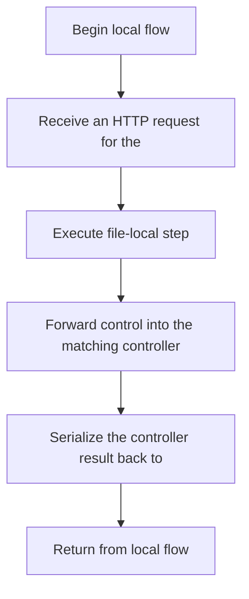

# auth.js

- Source: Backend/src/routes/auth.js
- Kind: JavaScript module

## Story
### What Happens Here

This route file is a traffic director rather than a business-logic endpoint. Its implementation wires HTTP verbs and paths to the middleware chain and then forwards the request into the controller that performs the real work.

### Why It Matters In The Flow

Reached after Express accepts a request and before controller logic executes.

### What To Watch While Reading

Maps HTTP routes to middleware and controllers. The main surface area is easiest to track through symbols such as express and router. It collaborates directly with express and ../controllers/authController.

## Program Flow
This diagram follows the action path in plain words. Decision diamonds show where the file can stop, branch, or repeat work instead of simply passing through a straight line.

## Reading Map
Read this file as: Maps HTTP routes to middleware and controllers.

Where it sits in the run: Reached after Express accepts a request and before controller logic executes.

Names worth recognizing while reading: express and router.

It leans on nearby contracts or tools such as express and ../controllers/authController.

## Documentation Note
- This markdown file is part of the generated docs/Codebase mirror.
- It was generated from the repository state on 2026-04-23 after reading the existing docs corpus and the current source tree.

