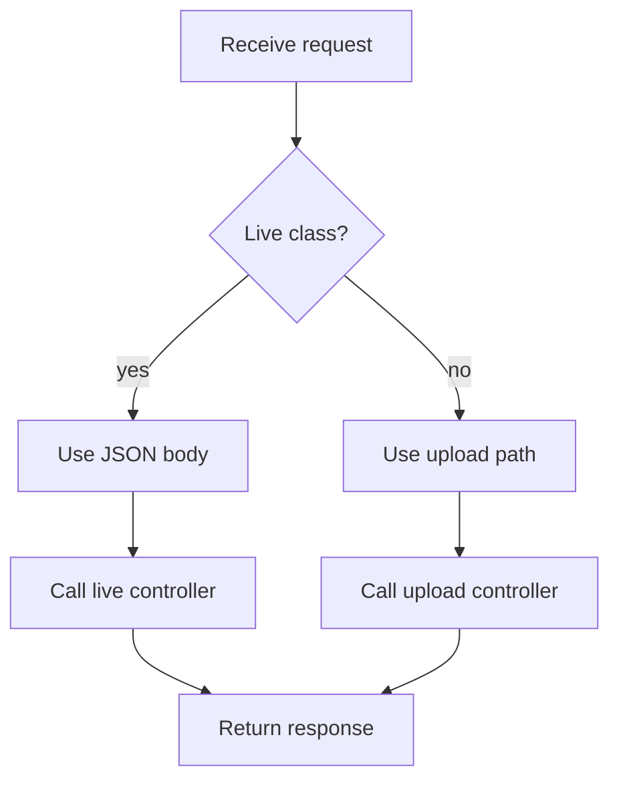

# transform.js

- Source: `Backend/src/routes/transform.js`
- Kind: JavaScript module

## Story
### What Happens Here

This route file maps transform-related HTTP traffic into controller entrypoints. The new live editor path should accept a completed class declaration as JSON and forward it to the controller without upload middleware.

The legacy upload route can stay as a separate compatibility path, but live class analysis must not depend on multipart file upload or source/target pattern fields.

### Why It Matters In The Flow

The frontend calls this route after `analysis.js` detects a complete class declaration. Routing must preserve that low-latency request path and avoid running unrelated file-upload middleware.

### What To Watch While Reading

Keep route ownership narrow:
- route chooses the endpoint and middleware chain.
- controller validates request body and coordinates services.
- services own lexical analysis, subtree analysis, AI documentation payloads, and structured logs.

## Route Flow

## Intended Routes

- `POST /api/transform/live-class`
  - JSON body.
  - Requires a complete class or struct declaration slice.
  - Calls `analyzeLiveClassDeclaration`.

- `POST /api/transform`
  - Existing upload path.
  - May remain for batch or legacy runs.

## Acceptance Checks

- The live class route does not use upload middleware.
- The live class route does not require source-pattern or target-pattern form fields.
- The route forwards to a controller named for analysis/documentation rather than transformation.
- Authentication behavior is consistent with the surrounding backend routes.
