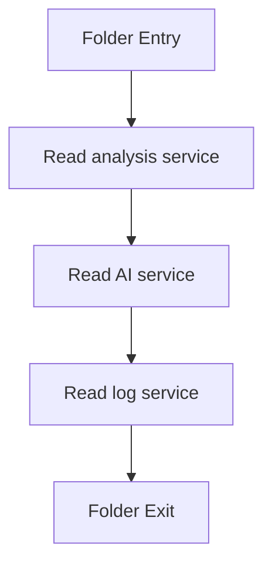

# services

- Folder: docs/Codebase/Backend/src/services
- Descendant source docs: 3
- Generated on: 2026-04-23

## Logic Summary
Reusable backend support services called from controllers or middleware. The live class-analysis path uses services to keep lexical/subtree analysis, AI documentation, and structured logging out of route/controller code.

## Subsystem Story
This folder is mostly leaf-level. The local documents here carry the main explanation of the subsystem without requiring much extra descent.

## Folder Flow

## Documents By Logic
### Services
These documents explain the local implementation by covering reusable analysis, AI documentation, and logging support.
- classDeclarationAnalysisService.js.md : Runs lexical analysis, subtree construction, cross-reference detection, and target selection for one complete class declaration.
- aiDocumentationService.js.md : Builds backend AI documentation requests from detected code units and normalizes generated documentation.
- logService.js.md : Persists structured analysis logs without old refactor or transform-output fields.

## Reading Hint
- Read `classDeclarationAnalysisService.js.md` before `aiDocumentationService.js.md`; AI documentation depends on the target list produced by analysis.

