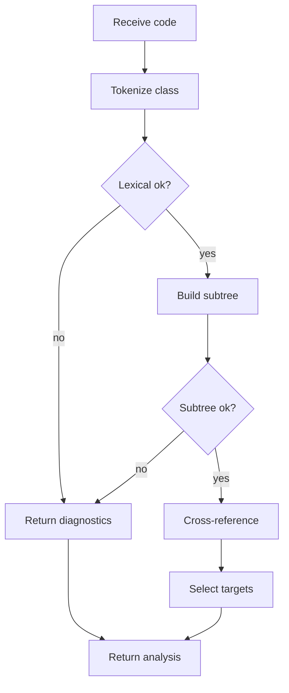

# classDeclarationAnalysisService.js

- Source: `Backend/src/services/classDeclarationAnalysisService.js`
- Kind: JavaScript service

## Story
### What Happens Here

This service is the backend coordinator for one completed class declaration. It receives a class slice from the controller, runs or delegates lexical analysis, builds the class subtree, asks the algorithm layer to cross-reference detected pattern evidence, and returns documentation and unit-test targets.

The service should not call AI directly. It prepares analysis facts and code units; `aiDocumentationService.js` turns those facts into AI documentation work.

### Why It Matters In The Flow

The frontend only knows that a class declaration appears complete. This service decides whether the class is lexically valid, parseable as a subtree, and relevant to a detected design pattern.

### What To Watch While Reading

Keep input validation separate from analysis validity:
- malformed JSON belongs in the controller.
- incomplete class declarations should be rejected before this service.
- lexical diagnostics belong to the lexical stage.
- subtree diagnostics belong to the parse stage.
- pattern evidence belongs to the cross-reference stage.

## Service Flow



## Output Contract

The service returns:
- `stage`: final completed or failed stage.
- `diagnostics`: lexer or subtree messages.
- `detectedPattern`: pattern detected through cross-referencing.
- `documentationTargets`: code units to document.
- `unitTestTargets`: code units to test.
- `analysisLog`: structured object suitable for `logService.js`.

## Documentation Target Shape

```json
{
  "targetId": "factory:Factory:create:branch-0",
  "tagType": "factory_branch",
  "symbolName": "Factory::create",
  "nodeKind": "Branch",
  "reason": "Branch returns a concrete product for a factory decision.",
  "documentationHint": "Explain how this branch participates in Factory creation.",
  "codeExcerpt": "if (kind == \"A\") return new ProductA();",
  "evidenceHash": 12345
}
```

## Unit-Test Target Shape

```json
{
  "targetId": "factory:Factory:create:branch-0",
  "testKind": "factory_branch_selection",
  "symbolName": "Factory::create",
  "expectedBehavior": "Selecting kind A creates ProductA.",
  "codeExcerpt": "if (kind == \"A\") return new ProductA();",
  "evidenceHash": 12345
}
```

## Acceptance Checks

- The service returns diagnostics instead of throwing for invalid C++ input.
- Documentation targets include the exact code excerpt to document.
- Unit-test targets are derived from detected design-pattern evidence.
- Returned data does not use refactor candidate fields.
