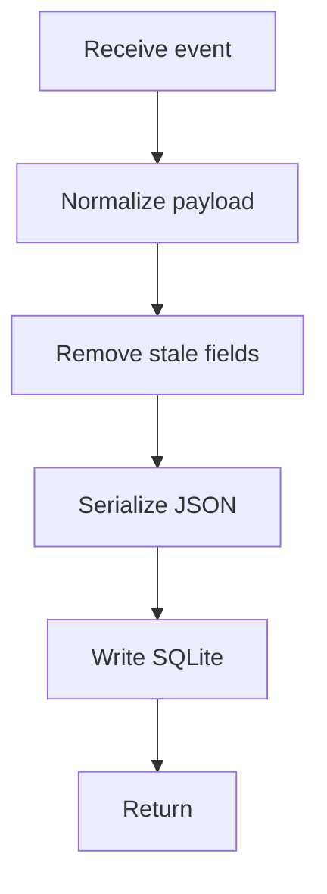

# logService.js

- Source: `Backend/src/services/logService.js`
- Kind: JavaScript module

## Story
### What Happens Here

This service owns structured backend audit and analysis log writes. For live class analysis, it should persist a JSON event that records what the backend detected, which code units must be documented, which unit tests should be generated, and what AI documentation status was returned.

The log schema should reflect the current product behavior: documentation and unit-test generation for detected design-pattern code. It should not preserve old refactor or transform-output language.

### Why It Matters In The Flow

Logs are used later for debugging, result history, and AI prompt traceability. If the log still says `refactor_candidate`, it misrepresents the pipeline because the system no longer refactors code.

### What To Watch While Reading

Prefer structured JSON payloads over free-form messages for analysis events. Free-form messages can remain for simple auth or health events, but live class analysis needs durable fields.

## Log Flow



## Live Analysis Log Shape

```json
{
  "event_type": "live_class_analysis",
  "document_id": "active-editor",
  "document_version": 17,
  "analysis_mode": "design_pattern_documentation",
  "detected_pattern": "factory",
  "analysis_stage": "complete",
  "graph_consistent": true,
  "documentation_targets": [],
  "unit_test_targets": [],
  "ai_documentation": {
    "status": "generated",
    "model": "configured-backend-model"
  }
}
```

## Forbidden Fields

Do not write these fields for the live analysis path:
- `source_input`
- `source_output`
- `target_output`
- `source_pattern` supplied by the frontend
- `target_pattern`
- `refactor_candidate`
- `refactor_candidate_class`

## Field Rules

- `detected_pattern` is algorithm output.
- `documentation_targets` are the code units formerly mislabeled as refactor candidates.
- `unit_test_targets` are generated from the same design-pattern evidence.
- `ai_documentation.status` may be `skipped`, `pending`, `generated`, or `failed`.

## Acceptance Checks

- Analysis logs are valid JSON.
- Logs include code-unit identifiers for documentation targets.
- Logs do not contain refactor terminology.
- Logs do not store user-selected source/target pattern values for the live path.
