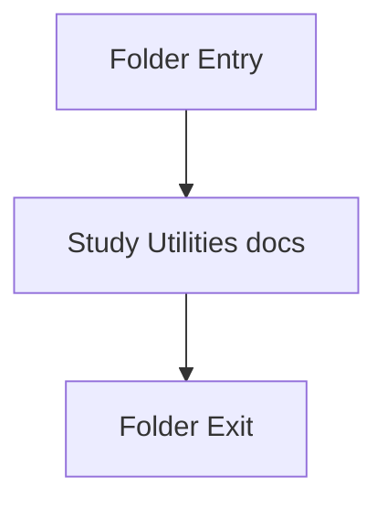

# utils

- Folder: docs/Codebase/Backend/src/utils
- Descendant source docs: 1
- Generated on: 2026-04-23

## Logic Summary
Small backend utilities used to keep the request handlers concise.

## Subsystem Story
This folder is mostly leaf-level. The local documents here carry the main explanation of the subsystem without requiring much extra descent.

## Folder Flow

## Documents By Logic
### Utilities
These documents explain the local implementation by covering Holds small reusable backend helpers.
- fileUtils.js.md : Holds small reusable backend helpers.

## Reading Hint
- This folder is mostly leaf-level. Read the local file docs to understand the logic in this area.

