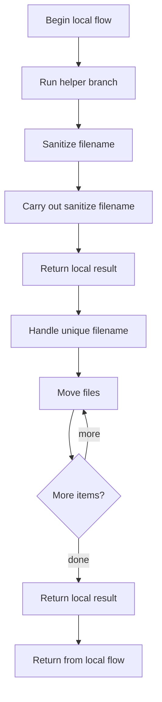
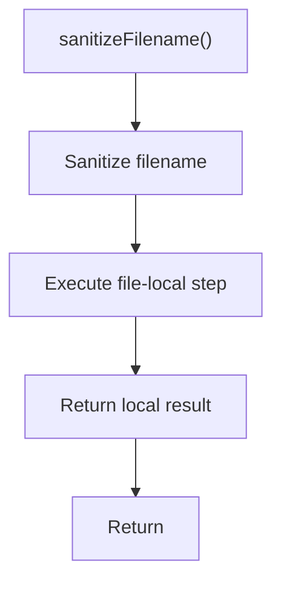
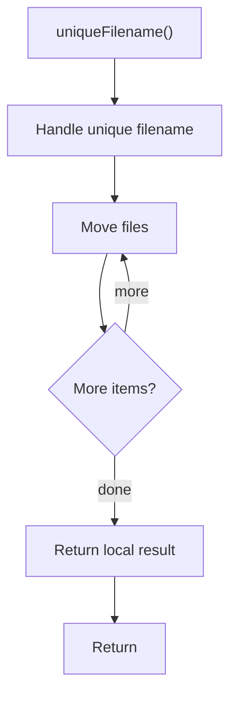

# fileUtils.js

- Source: Backend/src/utils/fileUtils.js
- Kind: JavaScript module

## Story
### What Happens Here

This utility file implements small backend helpers that keep request handlers and services from repeating low-level logic.

### Why It Matters In The Flow

This artifact participates in the repository flow according to the surrounding module or toolchain that loads it.

### What To Watch While Reading

Holds small reusable backend helpers. The main surface area is easiest to track through symbols such as sanitizeFilename, uniqueFilename, path, and fs. It collaborates directly with path and fs.

## Program Flow
This diagram follows the action path in plain words. Decision diamonds show where the file can stop, branch, or repeat work instead of simply passing through a straight line.

## Reading Map
Read this file as: Holds small reusable backend helpers.

Where it sits in the run: This artifact participates in the repository flow according to the surrounding module or toolchain that loads it.

Names worth recognizing while reading: sanitizeFilename, uniqueFilename, path, fs, base, and ext.

It leans on nearby contracts or tools such as path and fs.

## Story Groups

### Supporting Steps
These steps support the local behavior of the file.
- sanitizeFilename(): Owns a focused local responsibility.
- uniqueFilename(): Move or write filesystem artifacts

## Function Stories

### sanitizeFilename()
This routine owns one focused piece of the file's behavior.

The caller receives a computed result or status from this step.

What it does:
- This routine is primarily structural and does not expose obvious runtime operations from static inspection.

Flow:

### uniqueFilename()
This routine owns one focused piece of the file's behavior.

Inside the body, it mainly handles move or write filesystem artifacts.

The implementation iterates over a collection or repeated workload. The caller receives a computed result or status from this step.

What it does:
- move or write filesystem artifacts

Flow:

## Documentation Note
- This markdown file is part of the generated docs/Codebase mirror.
- It was generated from the repository state on 2026-04-23 after reading the existing docs corpus and the current source tree.

