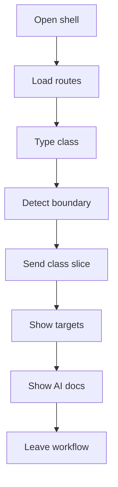

# Frontend

- Folder: docs/Codebase/Frontend
- Descendant source docs: 15
- Generated on: 2026-04-23
- Alignment update: 2026-04-25

## Logic Summary
Operator-facing browser shell for the NeoTerritory analysis workflow. This area groups the entrypoint, route fragments, scripts, and styles that let a user type source in the live editor, wait for a complete class declaration, call backend analysis, and inspect documentation or unit-test targets returned from the pipeline.

## Ownership Boundary
The frontend owns navigation, live editor state, class-boundary trigger status, diagnostics presentation, and target previews. It must not own lexical analysis, AST parsing, pattern detection, transformation rules, AI documentation prompt assembly, documentation tagging, unit-test generation, or output-file layout. Those concerns belong to the backend bridge and the C++ microservice docs under `docs/Codebase/Microservice`.

## Microservice Alignment
The frontend is the human-facing surface for a backend-orchestrated microservice run:
- It sends complete class declarations to the backend live-class route.
- It displays trigger state and backend diagnostics instead of inventing analysis state.
- It renders detected pattern evidence, documentation targets, unit-test targets, and AI documentation returned by the backend.
- It treats local placeholder data as temporary scaffolding only until the backend exposes the real artifact contract.

## Subsystem Story
This folder mixes concrete shell documents with deeper child subsystems. Read `index.html.md` first for the persistent browser frame, then read `scripts/analysis.js.md` for the class-boundary trigger, then `scripts/api.js.md` for the backend contract, then `pages/analysis-new.html.md` for the live analysis page.

## Folder Flow

## Child Folders By Logic
### Browser Logic
These child folders continue the subsystem by covering browser coordination, backend API calls, trigger state, diagnostics rendering, and page interactions.
- scripts/ : Browser logic that powers routing, live class-boundary detection, backend communication, diagnostics, and UI state changes.

### Styling
These child folders continue the subsystem by covering visual system and component styling for the analysis workflow frontend.
- styles/ : Visual system and component styling for the analysis workflow frontend.

### Pages
These child folders continue the subsystem by covering route-sized HTML fragments loaded by the client router.
- pages/ : Route-sized workflow screens for dashboard, live analysis, result inspection, suggested fixes, and output download.

## Documents By Logic
### Shell Entrypoints
These documents explain the local implementation by covering Defines the shell document for the hash-routed frontend application.
- index.html.md : Defines the persistent browser shell for the microservice analysis workflow.

## Reading Hint
- Read the shell first, then the API boundary, then the pages in user workflow order. Any analysis result shown in this folder should trace back to backend or microservice output, not frontend-only inference.

