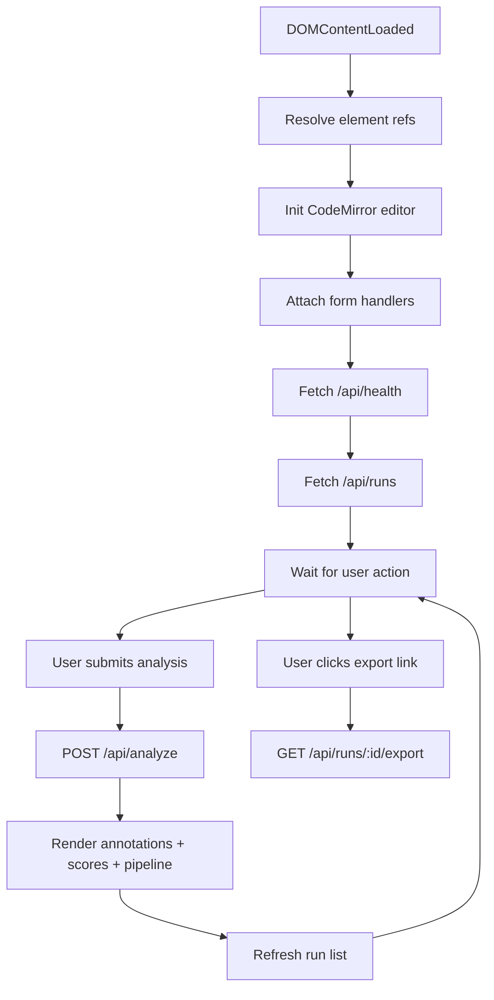

# app.js

- Source: Frontend/app.js
- Kind: JavaScript single-page controller

## Story
### What Happens Here

This file owns the entire client-side runtime of NeoTerritory Studio. It binds DOM event handlers to the elements declared in `index.html`, drives the CodeMirror editor, calls the backend analysis endpoints, renders pipeline stages, comment threads, run history, and score panels, and wires up the export downloads.

This file does not import a router and does not navigate between pages. The whole UX is one persistent view that mutates in place.

### Why It Matters In The Flow

The frontend is the user-facing surface for the documentation workflow. Per D20, the frontend never talks to the AI directly and never calls the C++ microservice directly. It only talks to the backend HTTP API. The backend, in turn, spawns the microservice and orchestrates the AI provider.

### What To Watch While Reading

Keep client logic narrow and declarative. The file should:
- own DOM state, editor state, and request state.
- not embed regex-based source analysis (that responsibility belongs to the microservice).
- not embed prompt templates (those belong to backend `aiDocumentationService.js`).

## Program Flow

## Module State

The module keeps a single `state` object with:
- `currentRun` — the most recently loaded analysis run (id, source name, source text, analysis payload).
- `runs` — list view backing the recent-runs panel.
- `editor` — the live CodeMirror instance.
- `activeLine`, `highlightedLines` — gutter highlight bookkeeping.
- `sourceBaseline`, `sourceDirty`, `sourceTemplateName` — used by the unsaved-edits modal.

## Backend Endpoints Consumed

- `GET  /api/health` — populates the backend status card.
- `GET  /api/sample` — loads the sample source template.
- `POST /api/analyze` — accepts either a file upload or a JSON `{filename, code}` body and returns the analysis payload.
- `GET  /api/runs` — lists recent runs.
- `GET  /api/runs/:id` — full run detail (re-rendered into the workspace).
- `GET  /api/runs/:id/export?format=commented-code|comments-only` — export downloads.

## Acceptance Checks

- The file contains no AI provider keys, no model names, and no prompt templates.
- The file contains no regex-based pattern detection. Detection is the microservice's responsibility, surfaced through the backend.
- All `fetch` calls target `/api/...` paths on the same origin (the backend serves the frontend statically).
- The CodeMirror dependency is consumed via the global `CodeMirror` symbol attached by the CDN script tags.
- The unsaved-edits modal blocks template overwrites until the user explicitly chooses to discard or keep.
