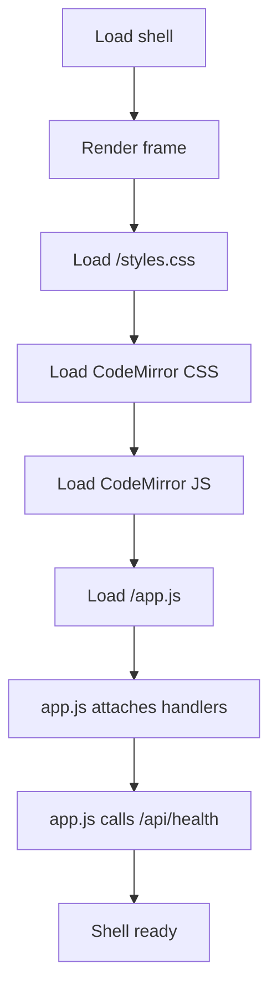

# index.html

- Source: Frontend/index.html
- Kind: HTML view

## Story
### What Happens Here

This file is the single-page browser shell for the NeoTerritory Studio analysis workflow. The shell renders one composite layout: a top status bar, a source-input composer, a CodeMirror editor with annotation rail, score and pipeline panels, recent-runs history, and an export action row. There is no client-side router and no per-page navigation — the entire UX lives on this single document.

### Why It Matters In The Flow

Browser entrypoint. The user loads this shell, the backend health check fires, and the user can immediately upload a source file, paste source code, run analysis, and review line-anchored documentation comments. All other UX states (annotated source view, comment threads, run history) are rendered into containers inside this shell by `app.js`.

### What To Watch While Reading

Keep the shell purely declarative. The shell defines layout containers, stylesheets, the CodeMirror dependency tags, and the `app.js` entrypoint. It does not perform analysis, build prompts, or call the AI. Analysis state belongs to `app.js`. Backend calls belong to `app.js`. Pattern detection and AI documentation generation belong to the backend, which in turn delegates structural detection to the C++ microservice (per D20).

## Program Flow

## Layout Sections

- `header.topbar` — eyebrow, title, lede, pipeline chip row (`Input → Analysis → Trees → Hashing → Output`), backend status card.
- `section.workspace` — two columns:
  - `article.composer` — file upload, filename text input, code textarea (upgraded to CodeMirror), source dirty-state indicator, run button, and the annotation rail with export links.
  - `aside.stack` — pipeline stage list and structure/modernization scores panel.
- `section.bottom-grid` — comment-threads panel and recent-runs history panel.
- `dialog.source-modal` — guards against accidentally overwriting unsaved edits when loading a template.

## External Dependencies

- CodeMirror 5.65.16 (CDN) — code editor with C-like mode, bracket matching, active-line highlight.
- Google Fonts (loaded via `styles.css`) — Space Grotesk and IBM Plex Mono.

## Acceptance Checks

- The shell file contains no inline JavaScript beyond the `<script>` tags that load CodeMirror addons and `app.js`.
- The shell does not reference any per-page route file or sidebar navigation.
- All interactive behavior is delegated to `app.js` via element ids that `app.js` looks up.
- `app.js` is loaded with `type="module"` so import semantics are available if needed in future extensions.
