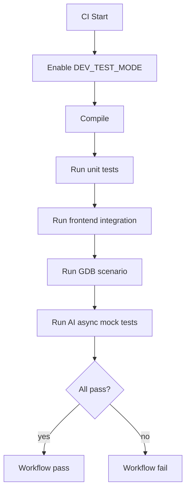
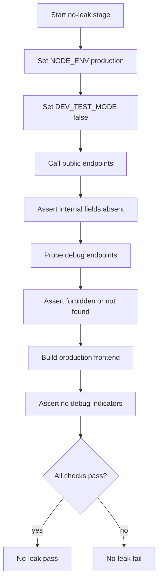

# github_actions_step_pipeline.md

## Story
This document defines a developer-only orchestration contract for Step 1 -> Step 2 and the GitHub Actions checks that enforce it. The contract is strict in CI but hidden from production users.

For pod warmup separation across CI and production flow, read `pod_warmup_separation.md`.

## Step flow model
- Step 1: backend returns structural result immediately.
- Step 2: backend runs asynchronous follow-up work and AI commentary job.
- Frontend test harness polls for Step 2 completion in dev/CI mode.

## Visibility split

### Public profile (production)
Expose only user-safe fields:
- final analysis status
- final result payload or user-safe failure message

Never expose:
- `step2JobId`
- per-phase Step 1/Step 2 timeline
- AI transport timings
- CI failure bucket labels

### Internal profile (developer and CI)
Enabled only with `DEV_TEST_MODE=true`:
- `step2JobId`
- phase transitions
- AI transport timings (`aiRequestSentAt`, `aiAckReceivedAt`, `aiFirstResponseAt`)
- failure buckets (`compile_failed`, `unit_failed`, `integration_failed`, `ai_send_failed`, `ai_timeout`)

## GitHub Actions gate contract

### Blocking stages
1. Compile whole system.
2. Unit tests.
3. Frontend-integrated Step 1 -> Step 2 test.
4. GDB runner scenario.
5. AI async send/response contract tests (mock provider).

Any stage failure fails the workflow.

### No-leak verification stage
Run production settings in CI:
- `NODE_ENV=production`
- `DEV_TEST_MODE=false`

Assertions:
- internal fields are omitted from responses
- internal debug endpoints are not mounted, forbidden, or return not found
- production frontend build does not render developer pipeline diagnostics

## Workflow slices

### Slice A - Internal CI orchestration
Quick summary: this slice shows strict CI checks with dev-test diagnostics enabled.

Why this slice is separate: it captures internal validation behavior only.

### Slice B - Production no-leak gate
Quick summary: this slice verifies production profile isolation independently.

Why this slice is separate: it validates production safety boundaries independently from developer diagnostics.

## Acceptance checks
- CI with `DEV_TEST_MODE=true` can assert full Step 1 -> Step 2 internal transitions.
- Production settings never expose internal diagnostics.
- Workflow blocks merge when any blocking stage fails.
