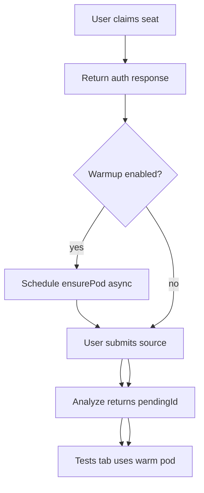
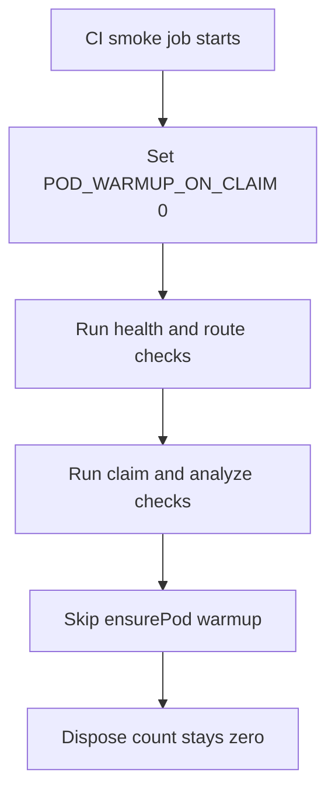
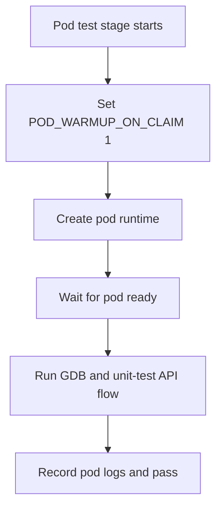

# pod_warmup_separation.md

## Story
This document defines the pod warmup boundary between production UX flow and GitHub Actions test flow. The goal is to keep production fast while preventing accidental pod startup during frontend and annotated-source CI checks.

## Ownership Boundary
- Owns CI-vs-production warmup trigger rules.
- Owns the `POD_WARMUP_ON_CLAIM` environment contract.
- Does not own pod runtime implementation details.
- Does not replace dedicated pod integration jobs.

## Runtime Intent
- Production: warmup starts after seat claim or submit path so Tests tab feels continuous.
- CI smoke and annotate flow: warmup stays off to avoid pod side effects.
- CI pod and GDB phases: pod checks stay on in dedicated stages only.

## Trigger Contract

### Warmup allowed
- `POD_WARMUP_ON_CLAIM=1`
- Non-CI user flow where claim/submit should pre-warm tests runtime

### Warmup blocked
- `POD_WARMUP_ON_CLAIM=0`
- CI smoke route checks
- CI annotated-source checks before test-runner stages

## Job Environment Matrix

| GitHub Actions job | Purpose | `POD_WARMUP_ON_CLAIM` |
| --- | --- | --- |
| `backend-microservice-build-and-test` | compile and service checks | `0` |
| `front-end-build-and-test` | frontend build checks | `0` |
| `playwright-annotated-source-testing` | route smoke + annotate API checks | `0` |
| `pod-build-and-test` | pod manifest and pod health checks | `1` |
| `gdb-runner-and-unit-tests` | test-runner integration with pod path | `1` |
| `production-no-leak-check` | production profile leak checks | `0` |

## Workflow Slices

### Slice A - Production warmup path
Quick summary: this slice shows non-blocking warmup in normal user flow.

Why this slice is separate: it captures user-experience continuity only.

### Slice B - CI smoke and annotate path
Quick summary: this slice shows how CI validates routes and analysis without warmup side effects.

Why this slice is separate: it keeps CI signal clean before pod integration stages.

### Slice C - Dedicated pod test path
Quick summary: this slice shows where pod startup is intentionally validated in CI.

Why this slice is separate: it isolates pod reliability checks to explicit jobs.

## Implementation Handoff Notes
- Backend claim/submit warmup gate should be conditioned by `POD_WARMUP_ON_CLAIM`.
- CI smoke and annotate jobs must set `POD_WARMUP_ON_CLAIM=0` explicitly.
- Pod and GDB jobs may set `POD_WARMUP_ON_CLAIM=1` or rely on direct pod orchestration in those stages.
- Emit structured logs for warmup decision:
  - `warmup skipped (reason=env_disabled)`
  - `warmup skipped (reason=ci_mode)`
  - `warmup scheduled (reason=claim)`
  - `warmup scheduled (reason=submit)`

## Migration Order
1. Add backend warmup gate on claim/submit entrypoints.
2. Apply CI env matrix in `.github/workflows/ci.yml`.
3. Re-run PR and push workflows to confirm stable separation.
4. Validate production warmup latency path manually.

## Acceptance Checks
- Smoke job shows no pod startup side effect and disposal count remains zero.
- Annotated-source CI checks pass without pod creation logs.
- Pod-build and GDB jobs show explicit pod creation and readiness checks.
- Production claim and submit paths still pre-warm pods for smoother Tests tab flow.

## Rebuild Boundary
If implementation changes imply rebuild or runtime verification, follow the `Rebuild Decision Matrix` in `CLAUDE.md` instead of running rebuild scripts from this docs task.
