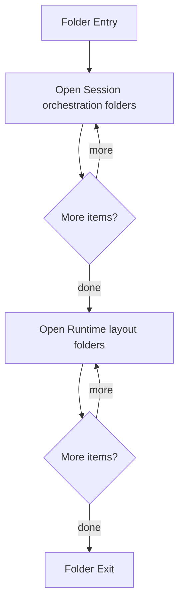

# Infrastructure

- Folder: docs/Codebase/Infrastructure
- Descendant source docs: 7
- Generated on: 2026-04-23

## Logic Summary
Infrastructure automation and runtime environment assembly for local containerized execution.

## Subsystem Story
This folder mainly acts as a navigation layer. Use it to understand how the deeper child folders divide the subsystem into smaller concerns.

## Folder Flow

## Child Folders By Logic
### Continuous Integration
These child folders continue the subsystem by covering developer-only and CI-only verification contracts, including Step 1 -> Step 2 orchestration checks and production no-leak assertions.
- ContinuousIntegration/ : GitHub Actions workflow blueprint for developer diagnostics and production isolation checks.

### Session Orchestration
These child folders continue the subsystem by covering Session bootstrap logic that prepares Docker, Minikube, runtime images, templates, and runtime folders.
- session-orchestration/ : Session bootstrap logic that prepares Docker, Minikube, runtime images, templates, and runtime folders.

### Runtime Layout
These child folders continue the subsystem by covering Scripts that create the filesystem layout expected by the executable runtime.
- runtime-layout/ : Scripts that create the filesystem layout expected by the executable runtime.

## Reading Hint
- Use the child folder groups to navigate deeper into this subsystem.

