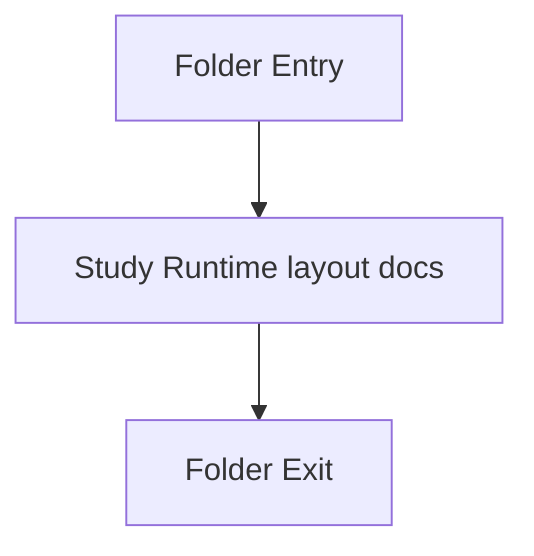

# runtime-layout

- Folder: docs/Codebase/Infrastructure/runtime-layout
- Descendant source docs: 2
- Generated on: 2026-04-23

## Logic Summary
Scripts that create the filesystem layout expected by the executable runtime.

## Subsystem Story
This folder is mostly leaf-level. The local documents here carry the main explanation of the subsystem without requiring much extra descent.

## Folder Flow

## Documents By Logic
### Runtime Layout
These documents explain the local implementation by covering Creates the Input and Output directory layout expected by the microservice runtime.
- setup_runtime_layout.ps1.md : Creates the Input and Output directory layout expected by the microservice runtime.
- setup_runtime_layout.sh.md : Creates the Input and Output directory layout expected by the microservice runtime.

## Reading Hint
- This folder is mostly leaf-level. Read the local file docs to understand the logic in this area.

