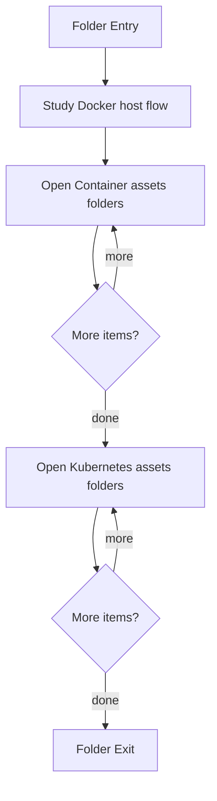
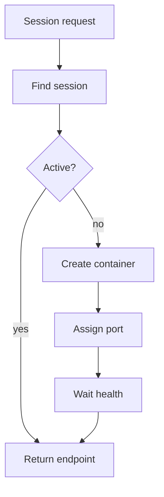

# session-orchestration

- Folder: docs/Codebase/Infrastructure/session-orchestration
- Descendant source docs: 5
- Generated on: 2026-04-23

## Logic Summary
Session bootstrap logic that prepares Docker runtime images and creates local Docker-backed runtime sessions on demand.

## Subsystem Story
This folder mixes concrete local documents with deeper child subsystems. Read the local docs to understand the visible behavior first, then descend into the child folders for the lower-level detail that supports it.

## Folder Flow

## Child Folders By Logic
### Container Assets
These child folders continue the subsystem by covering container image definitions and the local Docker session host.
- docker/ : Container image definitions and Docker-only request-driven session hosting.

### Kubernetes Assets
These child folders preserve the older Kubernetes deployment-side assets, but they are not the default local laptop path.
- k8s/ : Kubernetes deployment-side assets for user-scoped runtime sessions.

## Documents By Logic
### Bootstrap Orchestration
These documents explain the local implementation by covering dependency checks, Docker image build, request-driven session creation, and runtime layout preparation. They also preserve the legacy bootstrap path for environments that still use Kubernetes.
- bootstrap_and_deploy.ps1.md : Automates dependency install, Docker startup, image build, legacy template deployment, and runtime layout preparation.
- installer.config.json.md : Parameterizes the infrastructure bootstrap flow with image, profile, template, and runtime-root values.

## Local Docker Session Host
The desired laptop-local behavior is Docker-only. A user request should not route every user into one long-lived container. Instead, the backend should ask the local Docker session host to create or reuse a user-scoped container.

Implementation boundary:
- Use Docker Desktop as the local container engine.
- Build `neoterritory:local` from `Codebase/Infrastructure/session-orchestration/docker/Dockerfile`.
- Create containers with names like `neoterritory-session-{session_id}`.
- Publish each container's internal `3001` port to a free local host port.
- Track `session_id`, `container_id`, `host_port`, `created_at`, `last_seen_at`, and status.
- Reuse an active container when the same session asks again.
- Stop and remove expired containers through a cleanup loop.
- Keep Kubernetes and Minikube outside the default laptop-local path.

Acceptance checks:
- A first request for a session creates exactly one Docker container.
- A second request for the same active session reuses the existing container.
- Different sessions receive different containers and host ports.
- `/api/health` succeeds through the assigned host port before the endpoint is returned.
- Expired sessions are stopped and removed without deleting the image.

## Reading Hint
- Read the local file docs first for concrete behavior, then descend into the child folders for narrower subsystem details.
