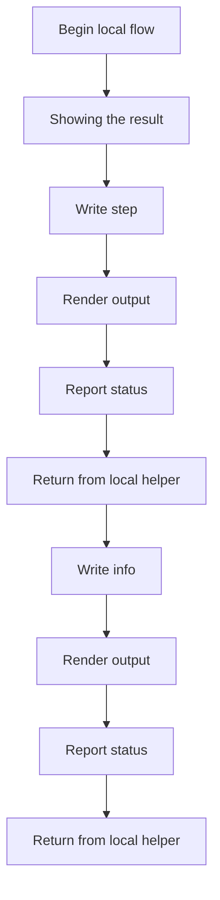
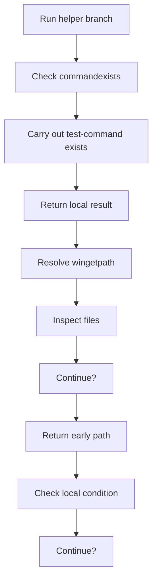
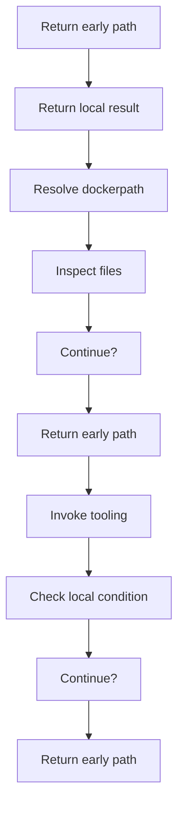
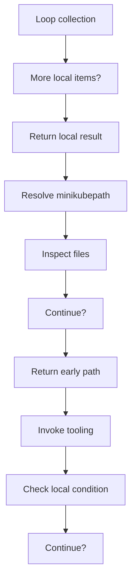
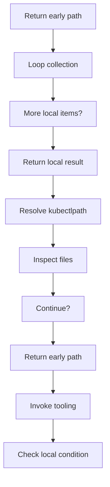
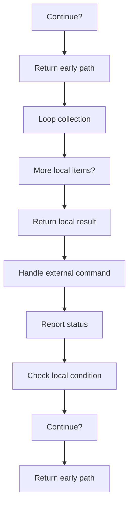
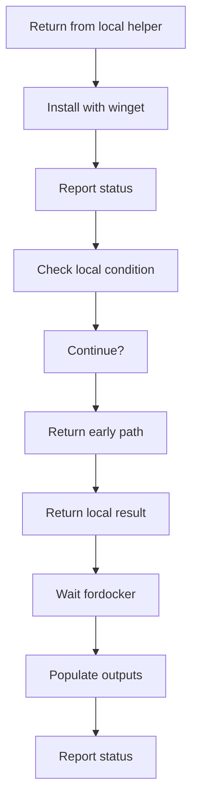
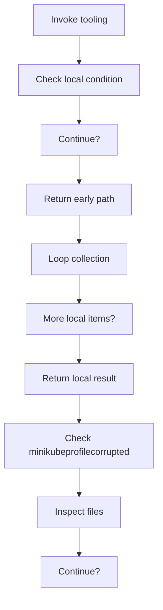

# bootstrap_and_deploy_program_flow_01.ps1

- Source document: [bootstrap_and_deploy.ps1.md](../bootstrap_and_deploy.ps1.md)
- Purpose: decoupled implementation logic for a future code unit.

This diagram follows the action path in plain words. Decision diamonds show where the file can stop, branch, or repeat work instead of simply passing through a straight line.

### Block 1 - Program Flow Details
#### Slice 1 - Continue Local Flow

#### Slice 2 - Continue Local Flow

#### Slice 3 - Continue Local Flow

#### Slice 4 - Continue Local Flow

#### Slice 5 - Continue Local Flow

#### Slice 6 - Continue Local Flow

#### Slice 7 - Continue Local Flow

#### Slice 8 - Continue Local Flow

