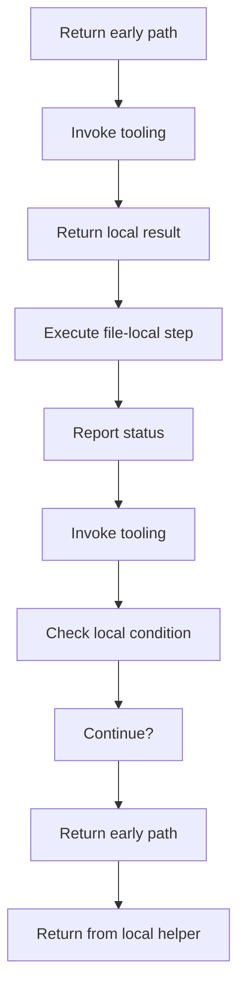
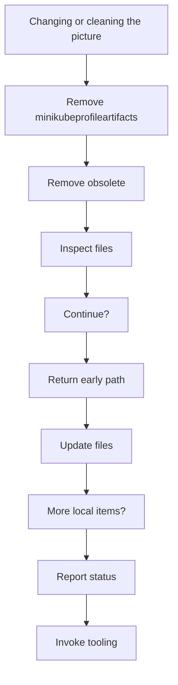
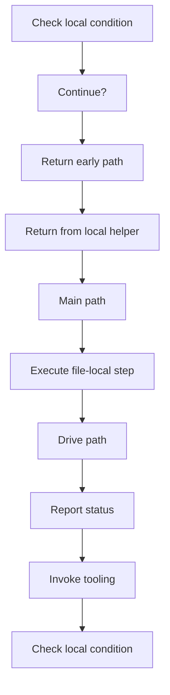
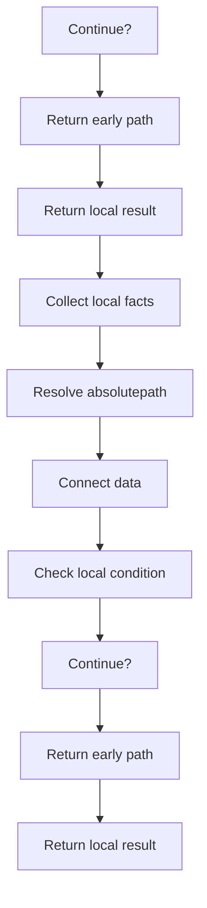
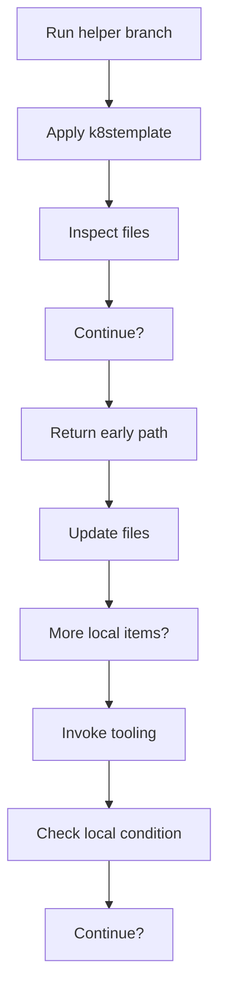
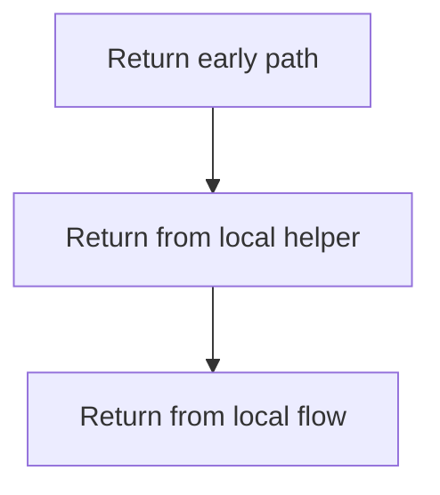

# bootstrap_and_deploy_program_flow_02.ps1

- Source document: [bootstrap_and_deploy.ps1.md](../bootstrap_and_deploy.ps1.md)
- Purpose: decoupled implementation logic for a future code unit.

#### Slice 9 - Continue Local Flow

#### Slice 10 - Continue Local Flow

#### Slice 11 - Continue Local Flow

#### Slice 12 - Continue Local Flow

#### Slice 13 - Continue Local Flow

#### Slice 14 - Continue Local Flow

