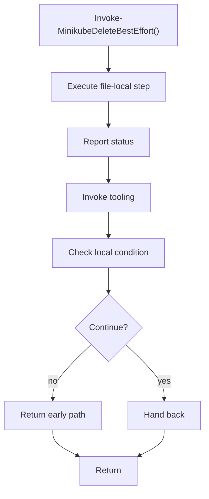

# invoke_minikubedeletebesteffort.ps1

- Source document: [bootstrap_and_deploy.ps1.md](../../bootstrap_and_deploy.ps1.md)
- Purpose: decoupled implementation logic for a future code unit.

### Invoke-MinikubeDeleteBestEffort()
This routine owns one focused piece of the file's behavior.

Inside the body, it mainly handles report status or failures to the caller, invoke external tooling, and branch on local conditions.

It branches on runtime conditions instead of following one fixed path.

What it does:
- report status or failures to the caller
- invoke external tooling
- branch on local conditions

Flow:

