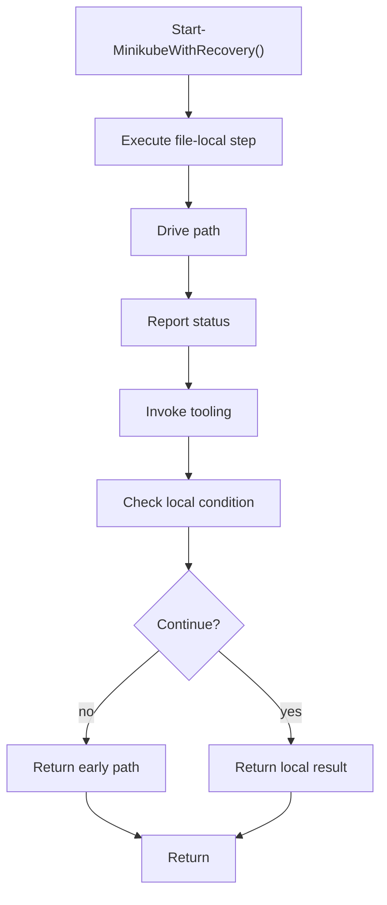

# start_minikubewithrecovery.ps1

- Source document: [bootstrap_and_deploy.ps1.md](../../bootstrap_and_deploy.ps1.md)
- Purpose: decoupled implementation logic for a future code unit.

### Start-MinikubeWithRecovery()
This routine prepares or drives one of the main execution paths in the file.

Inside the body, it mainly handles drive the main execution path, report status or failures to the caller, invoke external tooling, and branch on local conditions.

It branches on runtime conditions instead of following one fixed path. The caller receives a computed result or status from this step.

What it does:
- drive the main execution path
- report status or failures to the caller
- invoke external tooling
- branch on local conditions

Flow:

