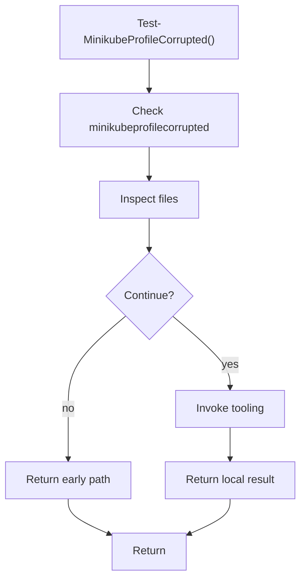

# test_minikubeprofilecorrupted.ps1

- Source document: [bootstrap_and_deploy.ps1.md](../../bootstrap_and_deploy.ps1.md)
- Purpose: decoupled implementation logic for a future code unit.

### Test-MinikubeProfileCorrupted()
This routine owns one focused piece of the file's behavior.

Inside the body, it mainly handles inspect the current filesystem state and invoke external tooling.

The caller receives a computed result or status from this step.

What it does:
- inspect the current filesystem state
- invoke external tooling

Flow:

