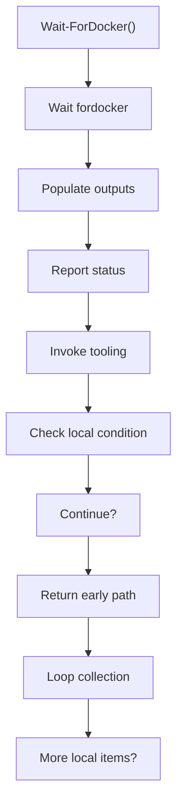
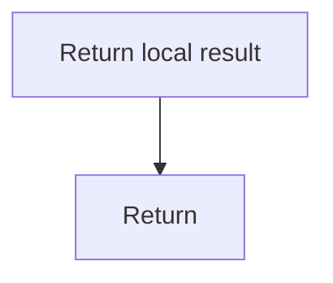

# wait_fordocker.ps1

- Source document: [bootstrap_and_deploy.ps1.md](../../bootstrap_and_deploy.ps1.md)
- Purpose: decoupled implementation logic for a future code unit.

### Wait-ForDocker()
This routine owns one focused piece of the file's behavior.

Inside the body, it mainly handles fill local output fields, report status or failures to the caller, invoke external tooling, and branch on local conditions.

The implementation iterates over a collection or repeated workload. It branches on runtime conditions instead of following one fixed path. The caller receives a computed result or status from this step.

What it does:
- fill local output fields
- report status or failures to the caller
- invoke external tooling
- branch on local conditions
- walk the local collection

Flow:

### Block 5 - Wait-ForDocker() Details
#### Slice 1 - Continue Local Flow

#### Slice 2 - Continue Local Flow

