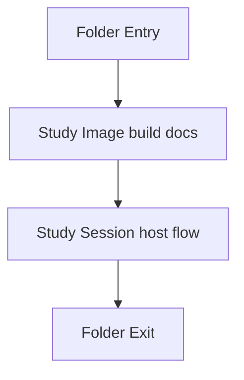
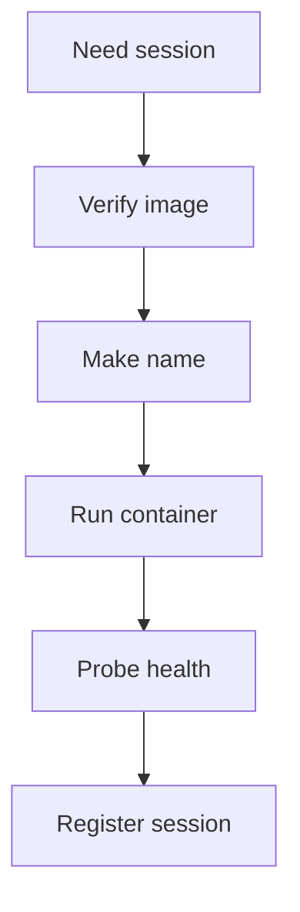

# docker

- Folder: docs/Codebase/Infrastructure/session-orchestration/docker
- Descendant source docs: 1
- Generated on: 2026-04-23

## Logic Summary
Container image definitions and Docker-only request-driven session hosting.

## Subsystem Story
This folder is mostly leaf-level. The local documents here carry the main explanation of the subsystem without requiring much extra descent.

## Folder Flow


## Documents By Logic
### Container Assets
These documents explain the local implementation by covering Builds the container image used for per-user NeoTerritory sessions.
- Dockerfile.md : Builds the container image used for per-user NeoTerritory sessions.

## Docker-Only Session Host
This folder owns the laptop-local container behavior. The backend should treat Docker Desktop as the local pod host and should create containers only when a session request needs one.



Concrete container contract:
- Image: `neoterritory:local`
- Container name: `neoterritory-session-{session_id}`
- Internal service port: `3001`
- Host port: allocated per session, starting from a configured range such as `18080-18999`
- Required env:
  - `PORT=3001`
  - `CORS_ORIGIN=*` for local development, replaced by explicit origins before production use

Creation command shape:
```bash
docker run -d \
  --name neoterritory-session-{session_id} \
  -p 127.0.0.1:{host_port}:3001 \
  -e PORT=3001 \
  -e CORS_ORIGIN='*' \
  neoterritory:local
```

Lookup behavior:
- Before creating a new container, inspect `neoterritory-session-{session_id}`.
- If it exists and health is OK, return the existing endpoint.
- If it exists but is unhealthy, remove and recreate it.
- If it does not exist, allocate a port and create it.

Cleanup behavior:
- Track `last_seen_at` for each session.
- Stop and remove containers idle beyond the configured TTL.
- Do not remove `neoterritory:local` during session cleanup.
- Use labels such as `neoterritory.session_id` and `neoterritory.owner=local-docker-host` so cleanup can find only owned containers.

Acceptance checks:
- `docker ps` shows one container per active session.
- Containers are isolated by name, port, process, and filesystem layer.
- A session request returns only after `/api/health` succeeds.
- Cleanup removes only containers with the local host ownership label.

## Reading Hint
- This folder is mostly leaf-level. Read the local file docs to understand the logic in this area.
