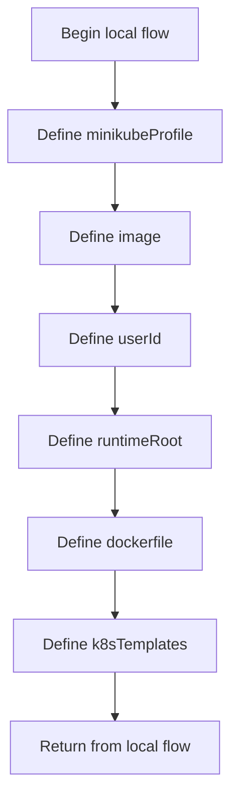

# installer.config.json

- Source: Infrastructure/session-orchestration/installer.config.json
- Kind: JSON configuration

## Story
### What Happens Here

This configuration file implements the parameter source for the bootstrap script. It carries the image tag, Minikube profile, runtime root, and template paths that determine how the environment is assembled.

### Why It Matters In The Flow

Runs before the C++ executable when the environment, runtime folders, container image, or Kubernetes assets need to be prepared.

### What To Watch While Reading

Parameterizes the infrastructure bootstrap flow with image, profile, template, and runtime-root values. The main surface area is easiest to track through symbols such as minikubeProfile, image, userId, and runtimeRoot.

## Program Flow
This diagram follows the action path in plain words. Decision diamonds show where the file can stop, branch, or repeat work instead of simply passing through a straight line.

## Reading Map
Read this file as: Parameterizes the infrastructure bootstrap flow with image, profile, template, and runtime-root values.

Where it sits in the run: Runs before the C++ executable when the environment, runtime folders, container image, or Kubernetes assets need to be prepared.

Names worth recognizing while reading: minikubeProfile, image, userId, runtimeRoot, dockerfile, and k8sTemplates.

## Documentation Note
- This markdown file is part of the generated docs/Codebase mirror.
- It was generated from the repository state on 2026-04-23 after reading the existing docs corpus and the current source tree.

