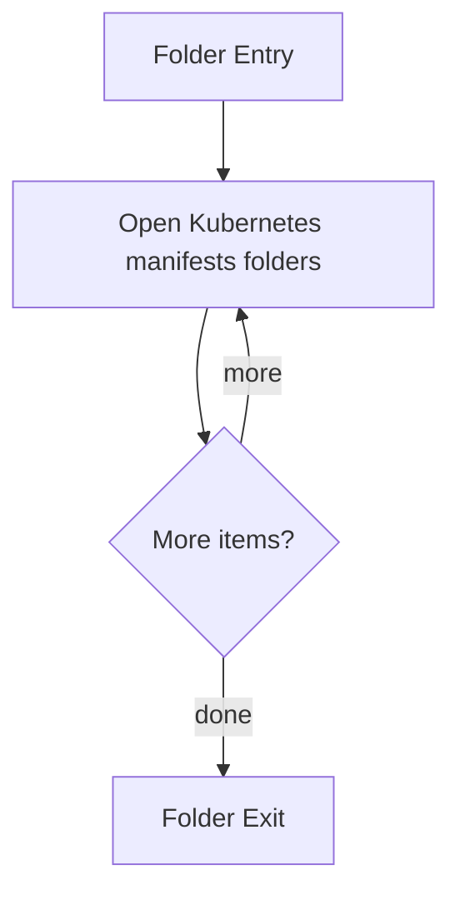

# k8s

- Folder: docs/Codebase/Infrastructure/session-orchestration/k8s
- Descendant source docs: 2
- Generated on: 2026-04-23

## Logic Summary
Kubernetes deployment-side assets for user-scoped runtime sessions.

## Subsystem Story
This folder mainly acts as a navigation layer. Use it to understand how the deeper child folders divide the subsystem into smaller concerns.

## Folder Flow

## Child Folders By Logic
### Kubernetes Manifests
These child folders continue the subsystem by covering Parameterized Kubernetes manifests rendered and applied by the bootstrap process.
- templates/ : Parameterized Kubernetes manifests rendered and applied by the bootstrap process.

## Reading Hint
- Use the child folder groups to navigate deeper into this subsystem.

