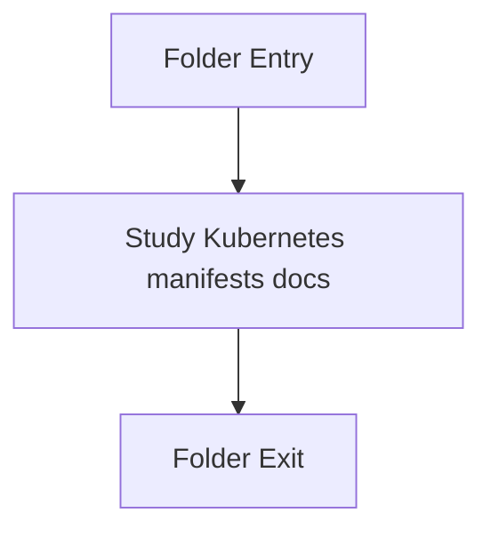

# templates

- Folder: docs/Codebase/Infrastructure/session-orchestration/k8s/templates
- Descendant source docs: 2
- Generated on: 2026-04-23

## Logic Summary
Parameterized Kubernetes manifests rendered and applied by the bootstrap process.

## Subsystem Story
This folder is mostly leaf-level. The local documents here carry the main explanation of the subsystem without requiring much extra descent.

## Folder Flow

## Documents By Logic
### Kubernetes Manifests
These documents explain the local implementation by covering Declares user-scoped Kubernetes resources for session pods and routing.
- user-routing.yaml.md : Declares user-scoped Kubernetes resources for session pods and routing.
- user-session-pod.yaml.md : Declares user-scoped Kubernetes resources for session pods and routing.

## Reading Hint
- This folder is mostly leaf-level. Read the local file docs to understand the logic in this area.

