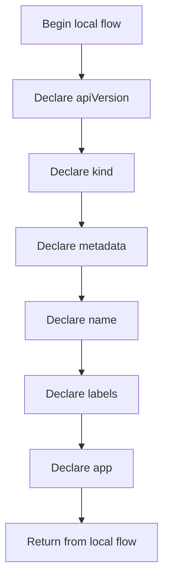

# user-routing.yaml

- Source: Infrastructure/session-orchestration/k8s/templates/user-routing.yaml
- Kind: YAML manifest

## Story
### What Happens Here

This manifest implements one deployment-side resource in the session orchestration story. The bootstrap script renders user-specific values into it and applies it so the runtime image becomes reachable inside the local cluster.

### Why It Matters In The Flow

Runs before the C++ executable when the environment, runtime folders, container image, or Kubernetes assets need to be prepared.

### What To Watch While Reading

Declares user-scoped Kubernetes resources for session pods and routing. The main surface area is easiest to track through symbols such as apiVersion, kind, metadata, and name.

## Program Flow
This diagram follows the action path in plain words. Decision diamonds show where the file can stop, branch, or repeat work instead of simply passing through a straight line.

## Reading Map
Read this file as: Declares user-scoped Kubernetes resources for session pods and routing.

Where it sits in the run: Runs before the C++ executable when the environment, runtime folders, container image, or Kubernetes assets need to be prepared.

Names worth recognizing while reading: apiVersion, kind, metadata, name, labels, and app.

## Documentation Note
- This markdown file is part of the generated docs/Codebase mirror.
- It was generated from the repository state on 2026-04-23 after reading the existing docs corpus and the current source tree.

